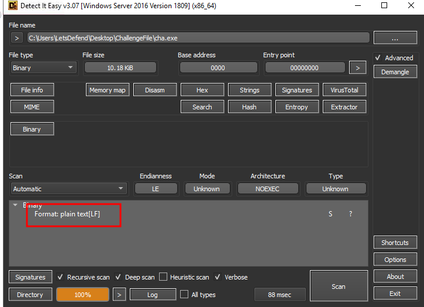
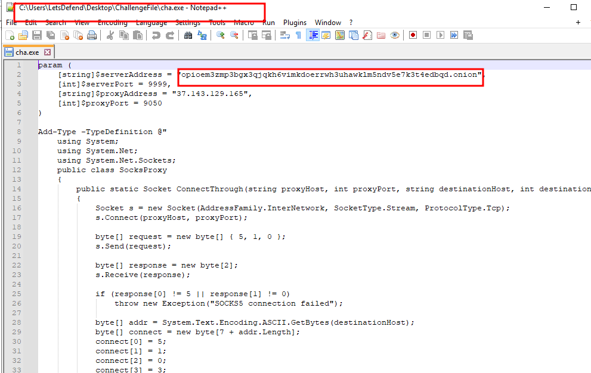
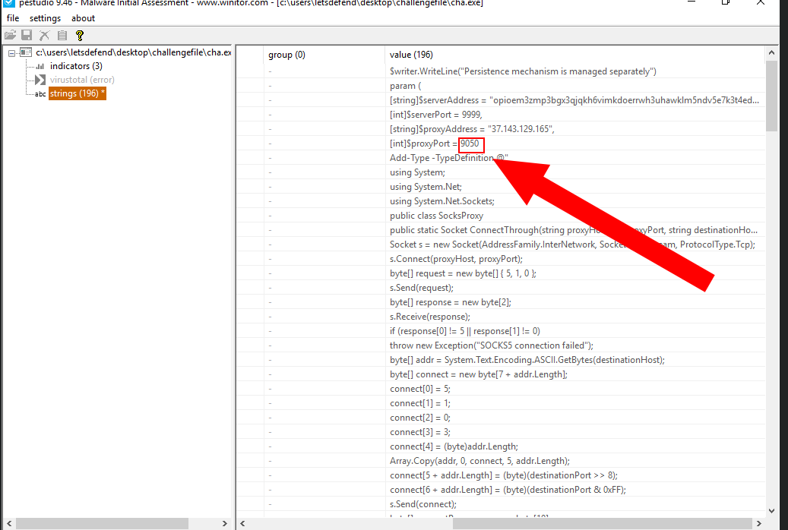
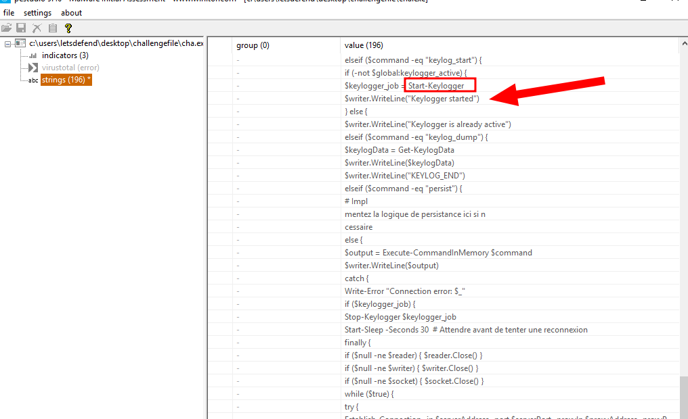
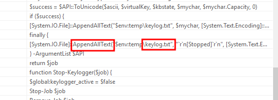
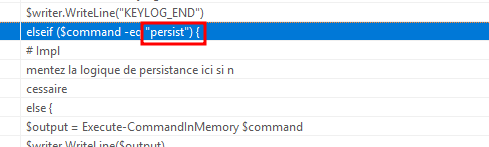
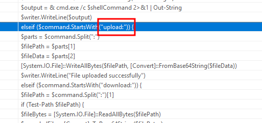
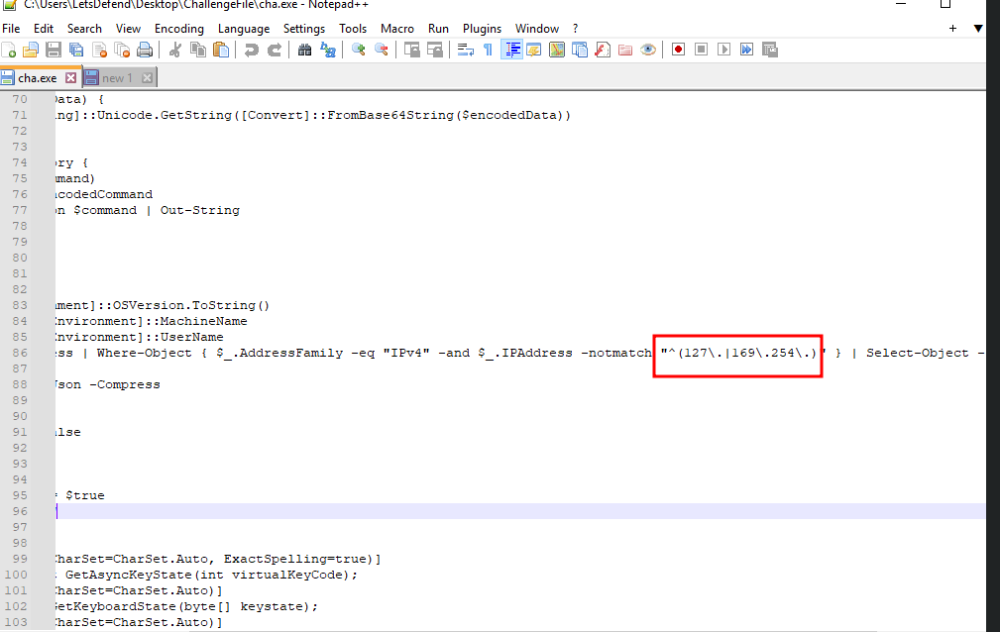
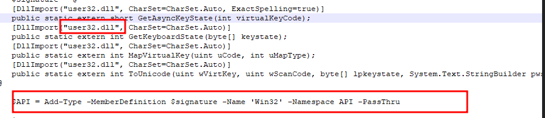
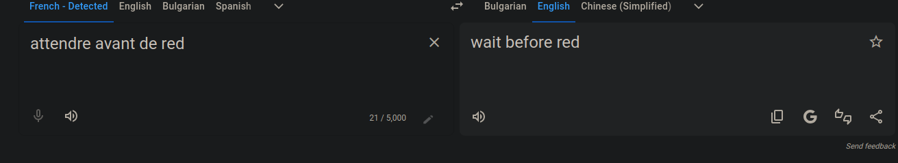

# PowerShell Keylogger Malware Analysis

## Scenario
The PowerShell script is suspected to be a keylogger that communicates with a remote server, possibly over a Tor network (indicated by a `.onion` link), logs keystrokes, achieves persistence, and exfiltrates data.

1. **Extraction**: Extracted `sample.7z` using the password `infected`.
2. **Initial Inspection**: Used Detect It Easy (DIE) to identify the file format, confirming it as plain text (unusual for malware).
   - 
3. **Static Analysis**: Opened the file in Notepad++ to confirm plain text and review the script. Used PEStudio to extract strings and grep in Notepad++ for specific patterns.
   - 

## Investigation Questions and Findings

### 1. Proxy Port Used by the Script
**Question**: What is the proxy port used by the script?

**Analysis**: Used PEStudio to extract strings from the plain-text script, identifying the proxy port as `9050`, commonly associated with Tor connections (e.g., for `.onion` addresses).

**Finding**: The script uses port `9050` for proxy communication, likely to connect to the `.onion` server.

- 

**Answer**: The proxy port is `9050`.

### 2. Function-Method for Starting Keylogging
**Question**: What function-method is used for starting keylogging?

**Analysis**: Scrolled through PEStudio strings to locate the keylogging function, identifying `Start-KeyLogger`.

**Finding**: The script uses the `Start-KeyLogger` function to initiate keylogging.

- 

**Answer**: The function-method is `Start-KeyLogger`.

### 3. Name of the File Used to Store Keylog Data
**Question**: What is the name of the file used by the script to store the keylog data?

**Analysis**: Extracted strings in PEStudio, finding `keylog.txt` as the file used to store captured keystrokes.

**Finding**: The script saves keylog data to `keylog.txt`.

- 

**Answer**: The file name is `keylog.txt`.

### 4. Command Used for Persistence
**Question**: What command is used by the script to achieve persistence?

**Analysis**: Identified the persistence command in PEStudio strings as `persist`.

**Finding**: The script uses the command `persist` to maintain persistence, likely by creating a scheduled task or registry entry.

- 

**Answer**: The command is `persist`.

### 5. Command Used to Upload Data
**Question**: What is the command used by the script to upload data?

**Analysis**: Found the upload command in PEStudio strings as `upload`.

**Finding**: The script uses the `upload` command to exfiltrate data, likely to the `.onion` server.

- 

**Answer**: The command is `upload`.

### 6. Regex Used to Filter IP Addresses
**Question**: What is the regex used by the script to filter IP addresses?

**Analysis**: Grep’d the script in Notepad++ to locate the regex pattern for IP filtering, finding `^(127\.|169\.254\.)`. This matches localhost (`127.0.0.1`) and link-local (`169.254.x.x`) addresses, likely to exclude them from communication.

**Finding**: The regex filters out localhost and link-local IP addresses.

- 

**Answer**: The regex is `^(127\.|169\.254\.)`.

### 7. DLL Imported for Keylogging APIs
**Question**: What is the DLL imported by the script to call keylogging APIs?

**Analysis**: Searched the script in Notepad++ for imported DLLs, identifying `user32.dll`, commonly used for keylogging APIs like `GetAsyncKeyState` or `SetWindowsHookEx`.

**Finding**: The script imports `user32.dll` for keylogging functionality.

- 

**Answer**: The DLL is `user32.dll`.

### 8. Seconds Before Re-establishing Connection
**Question**: How many seconds does the script wait before re-establishing a connection?

**Analysis**: Found `Start-Sleep 60` in the script via Notepad++, with a French comment indicating it controls the reconnection interval. Translated the comment to confirm it refers to the time delay for re-establishing a connection.

**Finding**: The script waits 60 seconds before attempting to reconnect to the server.

- 
- 

**Answer**: The script waits `60` seconds.

