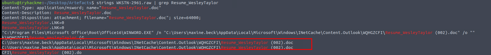

# Boogeyman 2: Phishing Attack Investigation

## Scenario
Maxine, a Human Resource Specialist at Quick Logistics LLC, received a phishing email disguised as a job application resume. The attached document was malicious and compromised her workstation. The security team flagged suspicious command executions, prompting an investigation. Attributed to the Boogeyman threat group, this targeted attack leverages a malicious document to initiate a multi-stage payload deployment. This investigation analyzes the phishing email and memory dump to assess the impact, focusing on initial access, payload execution, command-and-control (C2) communication, and persistence mechanisms.

## Challenge Questions and Findings

### Phishing Email Analysis
#### 1. Sender Email Address
**Question**: What email was used to send the phishing email?

**Answer**: `westaylor23@outlook.com`

**Investigation**: Opened `dump.eml` in Thunderbird and extracted the sender’s email address from the headers.

#### 2. Victim Email Address
**Question**: What is the email of the victim employee?

**Answer**: `maxine.beck@quicklogisticsorg.onmicrosoft.com`

**Investigation**: Identified the recipient’s email address in the `To` field of `dump.eml` using Thunderbird.

#### 3. Malicious Document Name
**Question**: What is the name of the attached malicious document?

**Answer**: `Resume_WesleyTaylor.doc`

**Investigation**: Downloaded the attachment from `dump.eml` in Thunderbird, identifying `Resume_WesleyTaylor.doc`.

#### 4. MD5 Hash of Malicious Attachment
**Question**: What is the MD5 hash of the malicious attachment?

**Answer**: `52c4384a0b9e248b95804352ebec6c5b`

**Investigation**: Computed the MD5 hash of `Resume_WesleyTaylor.doc` using a hashing tool on the downloaded attachment.

#### 5. URL for Stage 2 Payload
**Question**: What URL is used to download the stage 2 payload based on the document’s macro?

**Answer**: `https://files.boogeymanisback.lol/aa2a9c53cbb80416d3b47d85538d9971/update.png`

**Investigation**: Analyzed the document’s macro in the memory dump, revealing the URL for downloading the stage 2 payload.

### Endpoint and Memory Analysis
#### 6. Process Executing Stage 2 Payload
**Question**: What is the name of the process that executed the newly downloaded stage 2 payload?

**Answer**: `wscript.exe`

**Investigation**: Identified `wscript.exe` in the memory dump as the process executing the stage 2 payload (`update.js`).

#### 7. File Path of Stage 2 Payload
**Question**: What is the full file path of the malicious stage 2 payload?

**Answer**: `C:\ProgramData\update.js`

**Investigation**: Found the stage 2 payload’s file path in the memory dump, located at `C:\ProgramData\update.js`.

#### 8. PID and Parent PID of Stage 2 Process
**Question**: What is the PID of the process that executed the stage 2 payload? What is the parent PID of the process that executed the stage 2 payload?

**Answer**: PID: `4260`, Parent PID: `1124`

**Investigation**: Extracted the PID (`4260`) and parent PID (`1124`) of `wscript.exe` from the memory dump, associated with `update.js` execution.

#### 9. URL for Malicious Binary
**Question**: What URL is used to download the malicious binary executed by the stage 2 payload?

**Answer**: `https://files.boogeymanisback.lol/aa2a9c53cbb80416d3b47d85538d9971/update.exe`

**Investigation**: Identified the URL for the malicious binary (`update.exe`) downloaded by `update.js` in the memory dump.

#### 10. PID of C2 Process
**Question**: What is the PID of the malicious process used to establish the C2 connection?

**Answer**: `6216`

**Investigation**: Found the PID (`6216`) of the process (`updater.exe`) initiating the C2 connection in the memory dump.

#### 11. File Path of C2 Process
**Question**: What is the full file path of the malicious process used to establish the C2 connection?

**Answer**: `C:\Windows\Tasks\updater.exe`

**Investigation**: Identified the file path of `updater.exe` in the memory dump, used for C2 communication.

#### 12. IP Address and Port of C2 Connection
**Question**: What is the IP address and port of the C2 connection initiated by the malicious binary? (Format: IP address:port)

**Answer**: `128.199.95.189:8080`

**Investigation**: Extracted the C2 connection details from the memory dump, showing `updater.exe` connecting to `128.199.95.189:8080`.

#### 13. File Path of Malicious Email Attachment
**Question**: What is the full file path of the malicious email attachment based on the memory dump?

**Answer**: `C:\Users\maxine.beck\AppData\Local\Microsoft\Windows\INetCache\Content.Outlook\WQHGZCFI\Resume_WesleyTaylor (002).doc`

**Investigation**: Located the attachment’s file path in the memory dump, stored in Outlook’s cache directory.

#### 14. Command for Persistent Access
**Question**: The attacker implanted a scheduled task right after establishing the C2 callback. What is the full command used by the attacker to maintain persistent access?

**Answer**: `schtasks /Create /F /SC DAILY /ST 09:00 /TN Updater /TR 'C:\Windows\System32\WindowsPowerShell\v1.0\powershell.exe -NonI -W hidden -c \"IEX ([Text.Encoding]::UNICODE.GetString([Convert]::FromBase64String((gp HKCU:\Software\Microsoft\Windows\CurrentVersion debug).debug)))\"'`

**Investigation**: Identified the scheduled task creation command in the memory dump, ensuring daily execution of a base64-encoded PowerShell command at 09:00.

