# Boogeyman 3: Phishing Attack and Lateral Movement Investigation

## Scenario
The Boogeyman threat group compromised an employee at Quick Logistics LLC, maintaining stealthy access to target the CEO, Evan Hutchinson. A phishing email with a malicious attachment was opened by Evan on August 29–30, 2023, despite his skepticism. The security team flagged the attachment in the CEO’s Downloads folder and identified a file within an ISO payload. This investigation analyzes the compromise’s impact, tracing the initial payload, persistence mechanisms, command-and-control (C2) connections, privilege escalation, credential dumping, lateral movement, and ransomware deployment using provided artifacts (phishing email and memory dump).

## Challenge Questions and Findings

### Initial Payload Execution
#### 1. PID of Stage 1 Payload
**Question**: What is the PID of the process that executed the initial stage 1 payload?

**Answer**: `6392`

**Investigation**: Identified PID 6392 in the memory dump as the process executing the stage 1 payload.

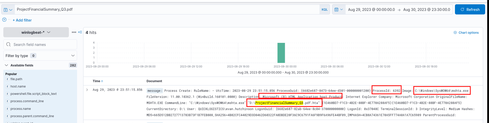

#### 2. Command-Line for File Implantation
**Question**: The stage 1 payload attempted to implant a file to another location. What is the full command-line value of this execution?

**Answer**: `"C:\Windows\System32\xcopy.exe" /s /i /e /h D:\review.dat C:\Users\EVAN~1.HUT\AppData\Local\Temp\review.dat`

**Investigation**: Extracted the command-line from the memory dump, showing `xcopy.exe` copying `review.dat` to the Temp directory.

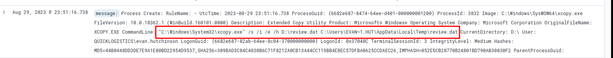

#### 3. Command-Line for Implanted File Execution
**Question**: The implanted file was eventually used and executed by the stage 1 payload. What is the full command-line value of this execution?

**Answer**: `"C:\Windows\System32\rundll32.exe" D:\review.dat,DllRegisterServer`

**Investigation**: Found the command-line in the memory dump, where `rundll32.exe` executed `review.dat` with `DllRegisterServer`.

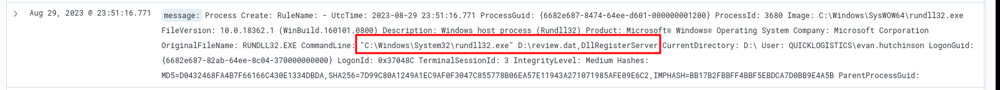

### Persistence Mechanism
#### 4. Scheduled Task Name
**Question**: The stage 1 payload established a persistence mechanism. What is the name of the scheduled task created by the malicious script?

**Answer**: `Review`

**Investigation**: Identified the scheduled task named `Review` in the memory dump, created by the stage 1 payload.

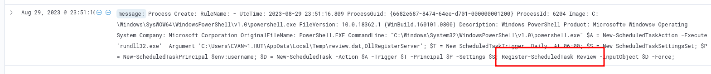

### C2 Connection
#### 5. IP and Port of C2 Connection
**Question**: The execution of the implanted file inside the machine has initiated a potential C2 connection. What is the IP and port used by this connection? (format: IP:port)

**Answer**: `165.232.170.151:80`

**Investigation**: Extracted network connection details from the memory dump, showing `review.dat` connecting to `165.232.170.151:80`.

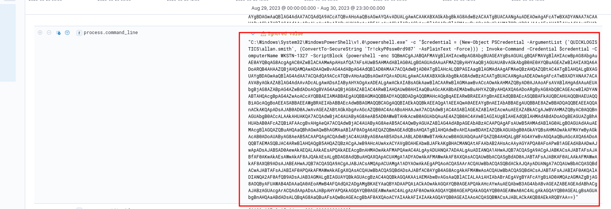 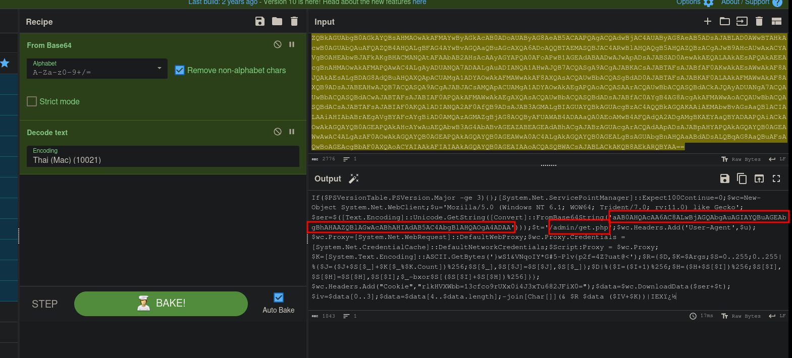 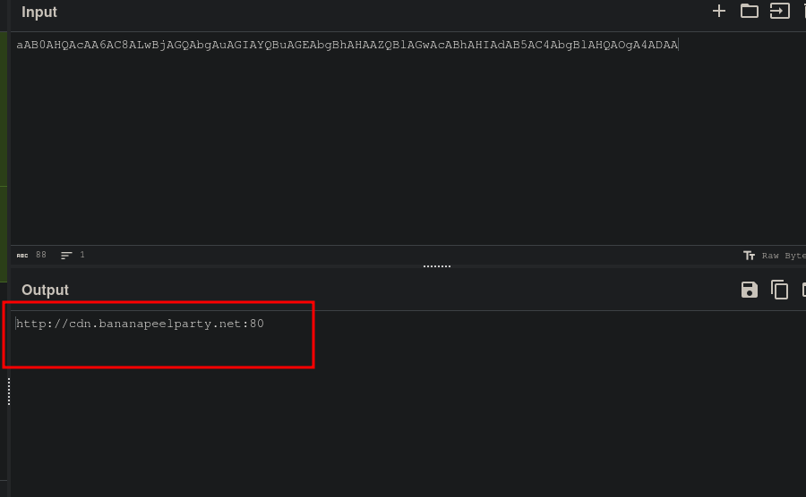 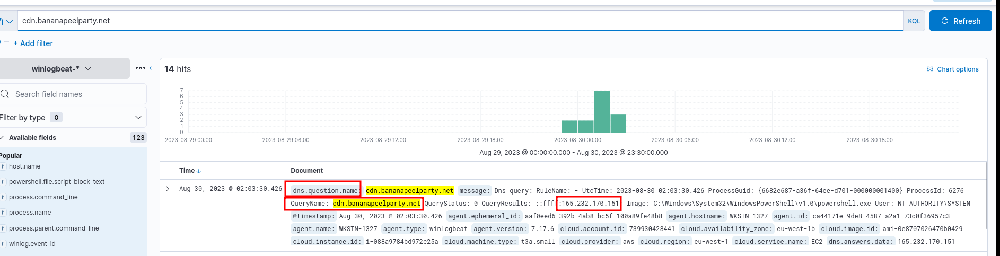

### Privilege Escalation
#### 6. Process for UAC Bypass
**Question**: The attacker has discovered that the current access is a local administrator. What is the name of the process used by the attacker to execute a UAC bypass?

**Answer**: `fodhelper.exe`

**Investigation**: Identified `fodhelper.exe` in the memory dump as the process used for UAC bypass, leveraging local administrator privileges.

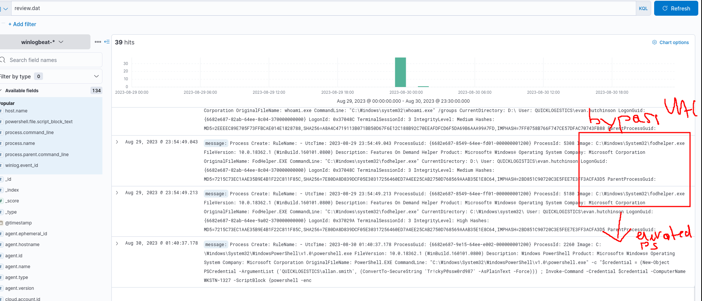

#### 7. GitHub Link for Credential Dumping Tool
**Question**: Having a high privilege machine access, the attacker attempted to dump the credentials inside the machine. What is the GitHub link used by the attacker to download a tool for credential dumping?

**Answer**: `https://github.com/gentilkiwi/mimikatz/releases/download/2.2.0-20220919/mimikatz_trunk.zip`

**Investigation**: Found the GitHub URL for `mimikatz` in the memory dump, used for credential dumping.

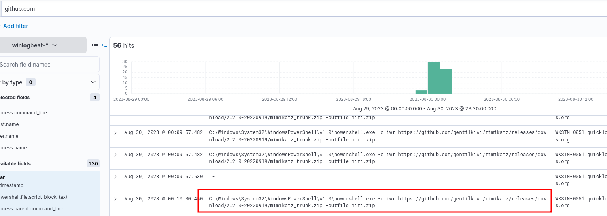

#### 8. Credential Pair from First Machine
**Question**: After successfully dumping the credentials inside the machine, the attacker used the credentials to gain access to another machine. What is the username and hash of the new credential pair? (format: username:hash)

**Answer**: `itadmin:F84769D250EB95EB2D7D8B4A1C5613F2`

**Investigation**: Extracted the `itadmin` credential and hash from the memory dump post-`mimikatz` execution.

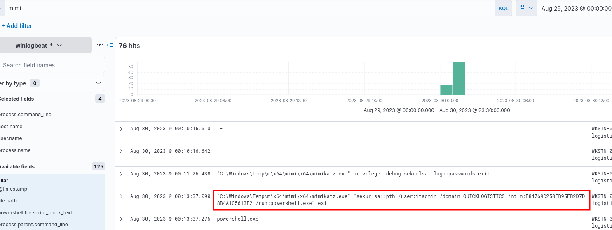

### Lateral Movement
#### 9. File Accessed from Remote Share
**Question**: Using the new credentials, the attacker attempted to enumerate accessible file shares. What is the name of the file accessed by the attacker from a remote share?

**Answer**: `IT_Automation.ps1`

**Investigation**: Identified `IT_Automation.ps1` in the memory dump as the file accessed from a remote share during enumeration.

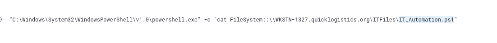

#### 10. New Credentials for Lateral Movement
**Question**: Using the new credentials, the attacker attempted to move laterally. What is the new set of credentials discovered by the attacker? (format: username:password)

**Answer**: `QUICKLOGISTICS\allan.smith:Tr!ckyP@ssw0rd987`

**Investigation**: Found the `allan.smith` credentials in the memory dump, used for lateral movement.

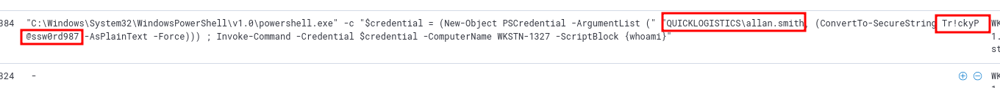

#### 11. Target Machine Hostname
**Question**: What is the hostname of the attacker’s target machine for its lateral movement attempt?

**Answer**: `WKSTN-1327`

**Investigation**: Identified `WKSTN-1327` as the target hostname in the memory dump for lateral movement.

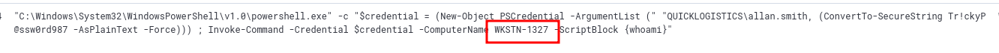

#### 12. Parent Process of Malicious Command
**Question**: Using the malicious command executed by the attacker from the first machine to move laterally, what is the parent process name of the malicious command executed on the second compromised machine?

**Answer**: `wsmprovhost.exe`

**Investigation**: Found `wsmprovhost.exe` as the parent process of the malicious command on `WKSTN-1327` in the memory dump.

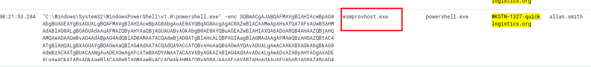

#### 13. Credentials Dumped from Second Machine
**Question**: The attacker then dumped the hashes in this second machine. What is the username and hash of the newly dumped credentials? (format: username:hash)

**Answer**: `administrator:00f80f2538dcb54e7adc715c0e7091ec`

**Investigation**: Extracted the `administrator` credential and hash from the memory dump, dumped on `WKSTN-1327`.

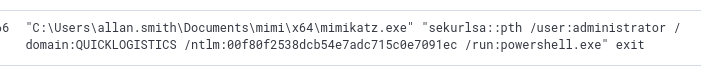

#### 14. DCSync Account
**Question**: After gaining access to the domain controller, the attacker attempted to dump the hashes via a DCSync attack. Aside from the administrator account, what account did the attacker dump?

**Answer**: `backupda`

**Investigation**: Identified `backupda` as an additional account dumped via DCSync in the memory dump.

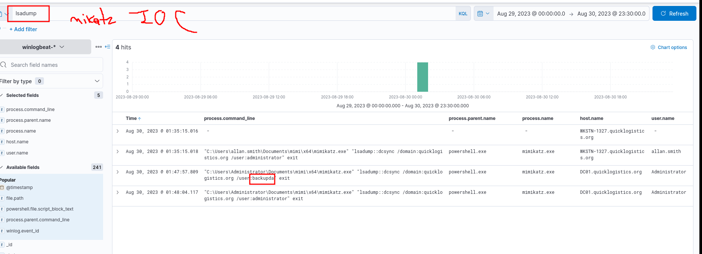

#### 15. Ransomware Binary Download Link
**Question**: After dumping the hashes, the attacker attempted to download another remote file to execute ransomware. What is the link used by the attacker to download the ransomware binary?

**Answer**: `http://ff.sillytechninja.io/ransomboogey.exe`

**Investigation**: Found the URL for the ransomware binary (`ransomboogey.exe`) in the memory dump.

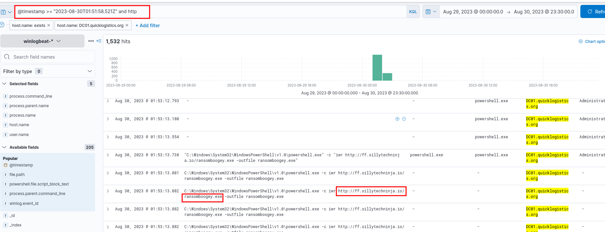

