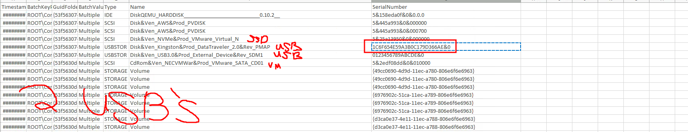
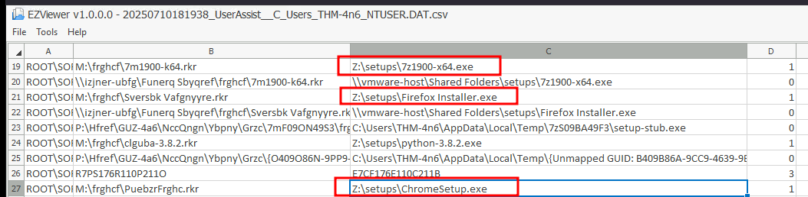
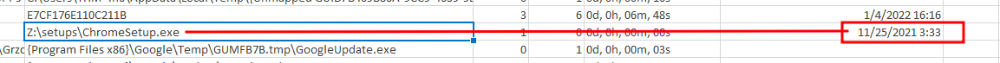
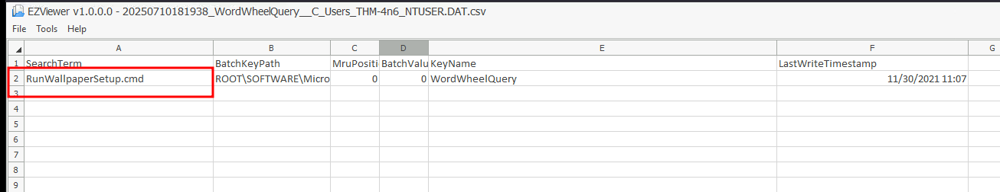
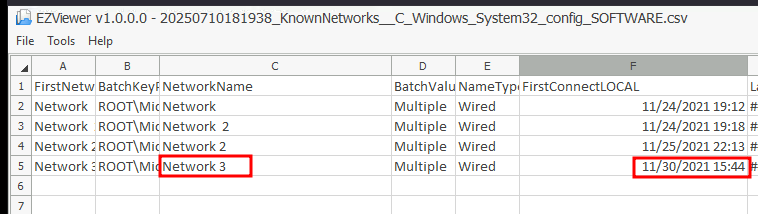
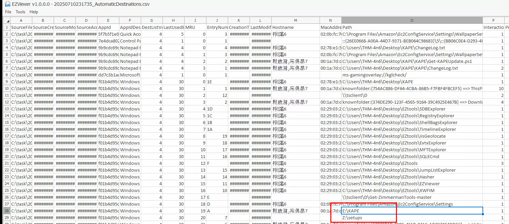

## Challenge: Investigating Policy Violation at Organization X

### Scenario
Organization X’s Acceptable Use Policy prohibits connecting removable or network drives, installing software from unknown locations, and connecting to unknown networks. A user on a VM (user: `thm-4n6`) is suspected of violating this policy. Use KAPE’s GUI to analyze triage data.

### Questions and Findings

#### 1. Serial Number of the Second USB Device
**Question**: Two USB Mass Storage devices were attached to the VM. One had a serial number `0123456789ABCDE`. What is the serial number of the other USB device?

**Answer**: `1C6F654E59A3B0C179D366AE&0`

#### 2. Drive Letter and Path of Software Installation
**Question**: 7zip, Google Chrome, and Mozilla Firefox were installed from a network drive. What was the drive letter and path of the directory from where these software were installed?

**Answer**: `Z:\Setups`

#### 3. Execution Date and Time of CHROMESETUP.EXE
**Question**: What is the execution date and time of `CHROMESETUP.EXE` in MM/DD/YYYY HH:MM?

**Answer**: `11/25/2021 03:33`

#### 4. Search Query Run on the System
**Question**: What search query was run on the system?

**Answer**: `RunWallpaperSetup.cmd`

#### 5. First Connection Time of Network 3
**Question**: When was the network named `Network 3` first connected to?

**Answer**: `11/30/2021 15:44`

#### 6. Drive Letter of KAPE’s Source
**Question**: KAPE was copied from a removable drive. What was the drive letter of the drive where KAPE was copied from?

**Answer**: `E:`

