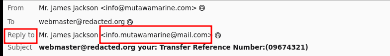

# The Greenholt Phish: Email Investigation [here](https://tryhackme.com/room/phishingemails5fgjlzxc)

## Scenario
A Sales Executive at Greenholt PLC received an unexpected email from a customer. The email used an unusual generic greeting ("Good day"), mentioned an unexpected money transfer, and included an unrequested attachment. Suspecting foul play, the executive forwarded the email to the SOC (Security Operations Center) for investigation. Using email forensics tools (e.g., Thunderbird, PhishTool, VirusTotal), analyze the email sample to determine its legitimacy, focusing on the email headers, sender details, attachment, and infrastructure.

## Challenge Questions and Findings

#### 1. Transfer Reference Number in Email Subject
**Question**: What is the Transfer Reference Number listed in the email's Subject?

**Answer**: `09674321`

#### 2. Email Sender Name
**Question**: Who is the email from?

**Answer**: `Mr. James Jackson`

#### 3. Sender Email Address
**Question**: What is his email address?

**Answer**: `info@mutawamarine.com`

#### 4. Reply-To Email Address
**Question**: What email address will receive a reply to this email?

**Answer**: `info.mutawamarine@mail.com`

#### 5. Originating IP
**Question**: What is the Originating IP?

**Answer**: `192.119.71.157`

#### 6. Owner of Originating IP
**Question**: Who is the owner of the Originating IP? (Do not include the "." in your answer.)

**Answer**: `Hostwinds LLC`

#### 7. SPF Record for Return-Path Domain
**Question**: What is the SPF record for the Return-Path domain?

**Answer**: `v=spf1 include:spf.protection.outlook.com -all`

#### 8. DMARC Record for Return-Path Domain
**Question**: What is the DMARC record for the Return-Path domain?

**Answer**: `v=DMARC1; p=quarantine; fo=1`

#### 9. Name of the Attachment
**Question**: What is the name of the attachment?

**Answer**: `SWT_#09674321____PDF__.CAB`

#### 10. SHA256 Hash of the File Attachment
**Question**: What is the SHA256 hash of the file attachment?

**Answer**: `2e91c533615a9bb8929ac4bb76707b2444597ce063d84a4b33525e25074fff3f`

#### 11. Attachment File Size
**Question**: What is the attachment's file size? (Don't forget to add "KB" to your answer, NUM KB)

**Answer**: `400.26 KB`

#### 12. Actual File Extension of the Attachment
**Question**: What is the actual file extension of the attachment?

**Answer**: `RAR`

