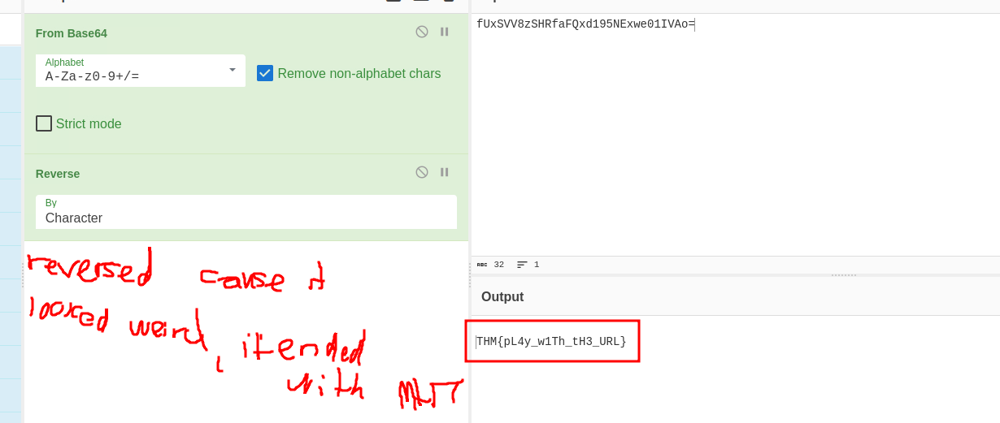

# Snapped Phish-ing Line: Phishing Email Investigation

[here](https://tryhackme.com/room/snappedphishingline)

## Scenario
As an IT department personnel at SwiftSpend Financial, you handle technical support for employees. On an ordinary midsummer day, multiple employees from various departments reported receiving unusual emails. Some employees submitted their credentials via these emails and can no longer log in. Using email forensics tools (e.g., Thunderbird, PhishTool, VirusTotal), analyze the phishing email sample to identify the recipient, sender, phishing URLs, and related artifacts to confirm the attack and uncover a hidden flag.

## Challenge Questions and Findings

#### 1. Individual Who Received Email Attachment
**Question**: Who is the individual who received an email attachment containing a PDF?

**Answer**: `William McClean`

#### 2. Adversary's Email Address
**Question**: What email address was used by the adversary to send the phishing emails?

**Answer**: `Accounts.Payable@groupmarketingonline.icu`

#### 3. Redirection URL for Zoe Duncan
**Question**: What is the redirection URL to the phishing page for the individual Zoe Duncan? (defanged format)

**Answer**: `hxxp[://]kennaroads[.]buzz/data/Update365/office365/40e7baa2f826a57fcf04e5202526f8bd/?email=zoe[.]duncan@swiftspend[.]finance&error`

#### 4. URL to Phishing Kit Archive
**Question**: What is the URL to the .zip archive of the phishing kit? (defanged format)

**Answer**: `hxxp[://]kennaroads[.]buzz/data/Update365[.]zip`

#### 5. SHA256 Hash of Phishing Kit Archive
**Question**: What is the SHA256 hash of the phishing kit archive?

**Answer**: `ba3c15267393419eb08c7b2652b8b6b39b406ef300ae8a18fee4d16b19ac9686`

#### 6. First Submission Time of Phishing Kit Archive
**Question**: When was the phishing kit archive first submitted? (format: YYYY-MM-DD HH:MM:SS UTC)

**Answer**: `2020-04-08 21:55:50`

#### 7. SSL Certificate First Logged
**Question**: When was the SSL certificate the phishing domain used to host the phishing kit archive first logged? (format: YYYY-MM-DD)

**Answer**: `2020-06-25`

#### 8. User Who Submitted Password Twice
**Question**: What was the email address of the user who submitted their password twice?

**Answer**: `michael.ascot@swiftspend.finance`

#### 9. Adversary's Credential Collection Email
**Question**: What was the email address used by the adversary to collect compromised credentials?

**Answer**: `m3npat@yandex.com`

#### 10. Adversary's Other Email Address
**Question**: The adversary used other email addresses in the obtained phishing kit. What is the email address that ends in "@gmail.com"?

**Answer**: `jamestanner2299@gmail.com`

#### 11. Hidden Flag
**Question**: What is the hidden flag?

**Answer**: `THM{pL4y_w1Th_tH3_URL}`

