# Secret Recipe

[here](https://tryhackme.com/room/registry4n6)

## Scenario
Jasmine owns Coffely, a famous New York coffee shop known for its unique taste, with the secret recipe stored only on her work laptop. James from the IT department recently fixed Jasmine’s laptop and is suspected of copying the recipe to his machine. His machine was confiscated, but no traces were found initially. The security department extracted registry artifacts and tasked you with analyzing them to determine if secret files were present on James’s machine.

## Challenge Questions and Findings

#### 1. Computer Name
**Question**: What is the computer name of the machine found in the registry?

**Answer**: `JAMES`

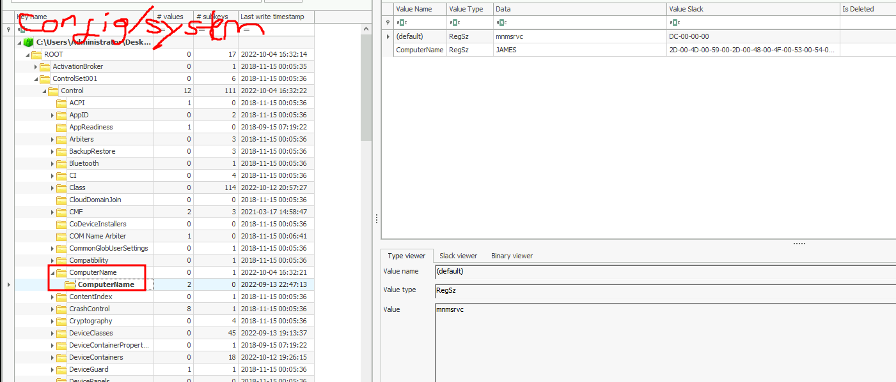

#### 2. Administrator Account Creation Time
**Question**: When was the Administrator account created on this machine? (Format: yyyy-mm-dd hh:mm:ss)

**Answer**: `2021-03-17 14:58:48`

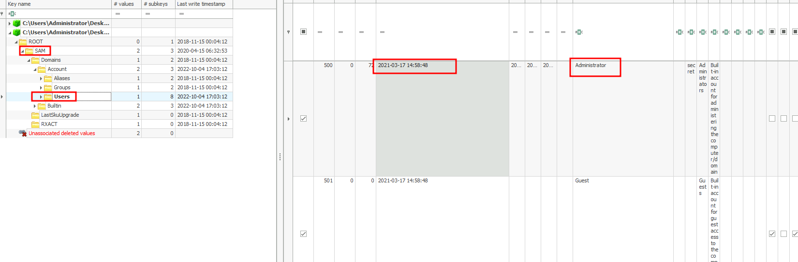

#### 3. RID of Administrator Account
**Question**: What is the RID associated with the Administrator account?

**Answer**: `500`

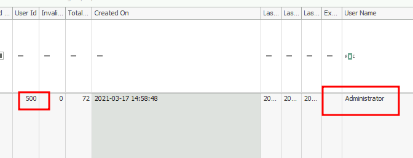

#### 4. Number of User Accounts
**Question**: How many user accounts were observed on this machine?

**Answer**: `7`

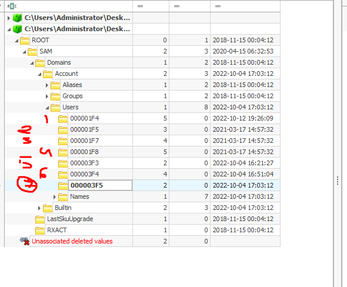

#### 5. Suspicious Account Name with RID 1013
**Question**: There seems to be a suspicious account created as a backdoor with RID 1013. What is the account name?

**Answer**: `bdoor`

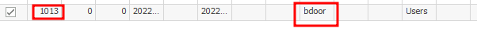

#### 6. VPN Connection
**Question**: What is the VPN connection this host connected to?

**Answer**: `ProtonVPN`

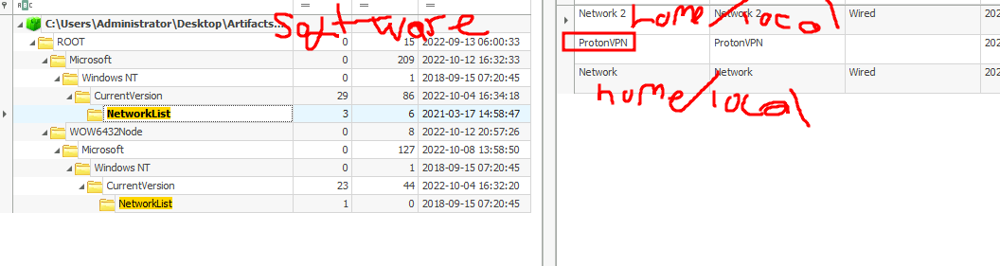

#### 7. First VPN Connection Time
**Question**: When was the first VPN connection observed? (Format: YYYY-MM-DD HH:MM:SS)

**Answer**: `2022-10-12 19:52:36`

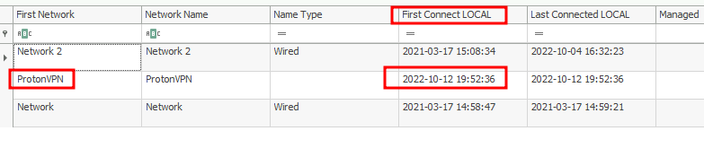

#### 8. Path of the Third Shared Folder
**Question**: There were three shared folders observed on his machine. What is the path of the third share?

**Answer**: `C:\RESTRICTED FILES`

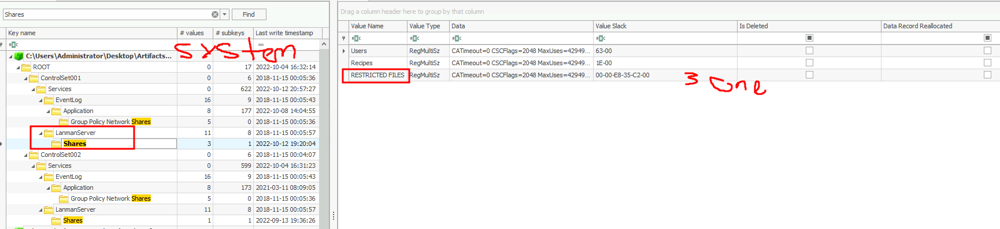

#### 9. Last DHCP IP Assigned
**Question**: What is the last DHCP IP assigned to this host?

**Answer**: `172.31.2.197`

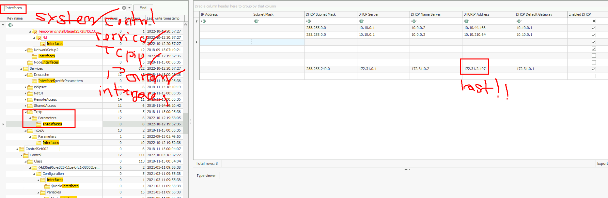

#### 10. File Containing Secret Coffee Recipe
**Question**: The suspect seems to have accessed a file containing the secret coffee recipe. What is the name of the file?

**Answer**: `secret-recipe.pdf`

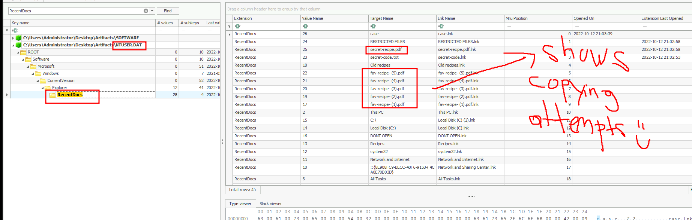

#### 11. Command to Enumerate Network Interfaces
**Question**: The suspect executed multiple commands using the Run window. What command was used to enumerate the network interfaces?

**Answer**: `pnputil /enum-interfaces`

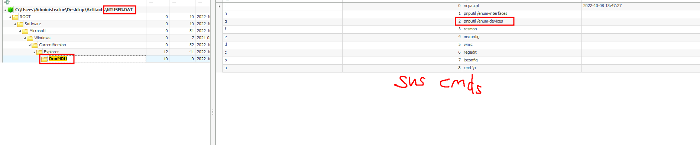

#### 12. Network Utility Tool Searched
**Question**: The user searched for a network utility tool to transfer files using the file explorer. What is the name of that tool?

**Answer**: `netcat`

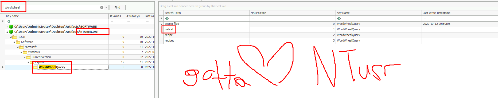

#### 13. Recent Text File Opened
**Question**: What is the recent text file opened by the suspect?

**Answer**: `secret-code.txt`

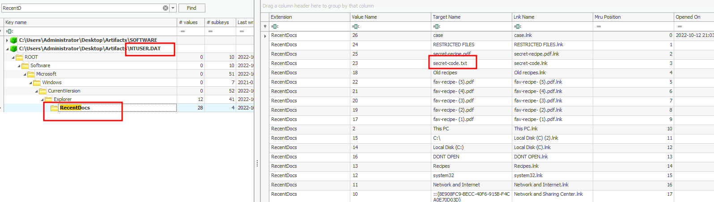

#### 14. PowerShell Execution Count
**Question**: How many times was PowerShell executed on this host?

**Answer**: `3`

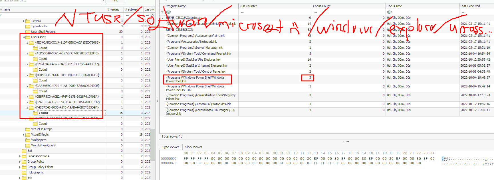

#### 15. Network Monitoring Tool Executed
**Question**: The suspect also executed a network monitoring tool. What is the name of the tool?

**Answer**: `wireshark`

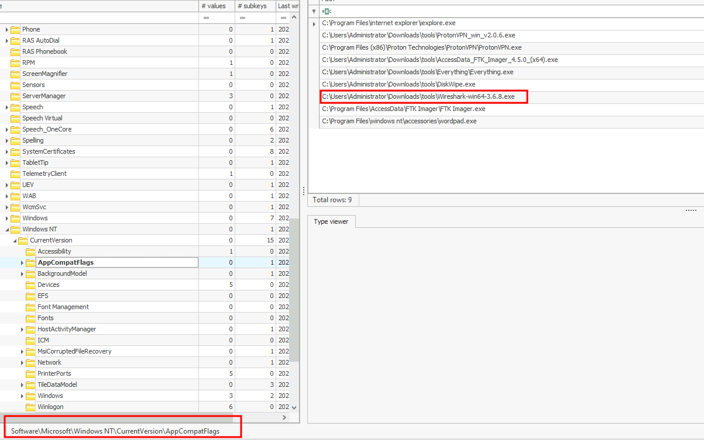

#### 16. ProtonVPN Focus Time
**Question**: Registry Hives also note the amount of time a process is in focus. Examine the Hives and confirm for how many seconds was ProtonVPN executed?

**Answer**: `343`

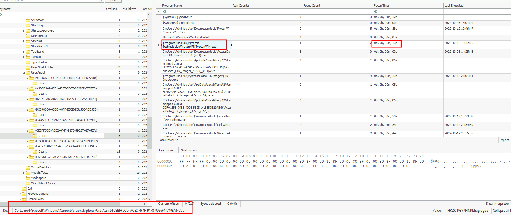

#### 17. Full Path of Everything.exe
**Question**: Everything.exe is a utility used to search for files in a Windows machine. What is the full path from which everything.exe was executed?

**Answer**: `C:\Users\Administrator\Downloads\tools\Everything\Everything.exe`

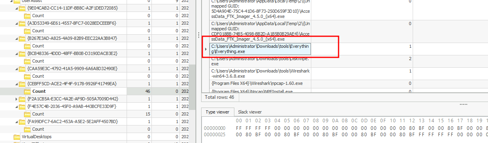
