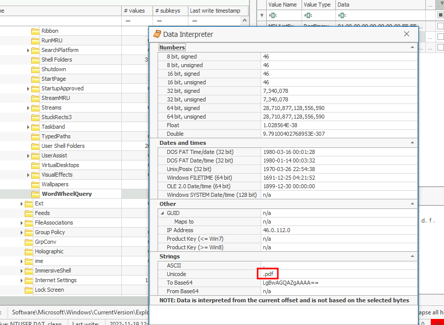
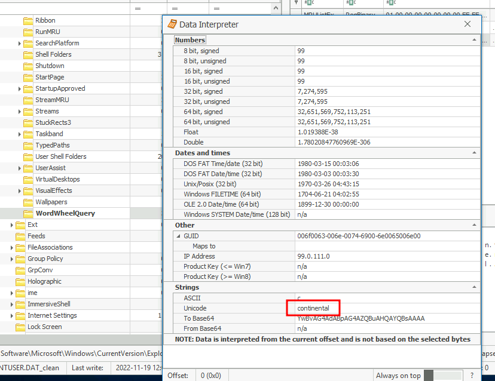
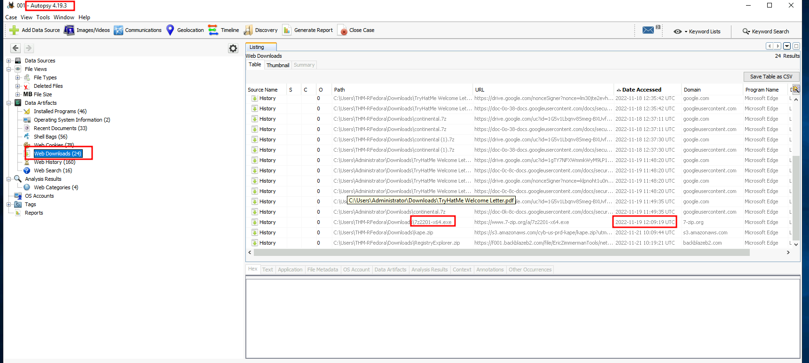
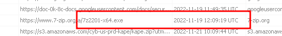
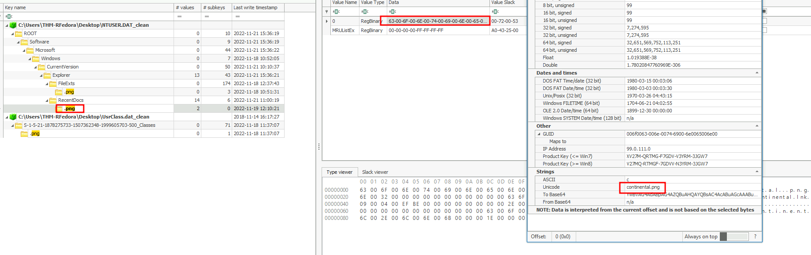
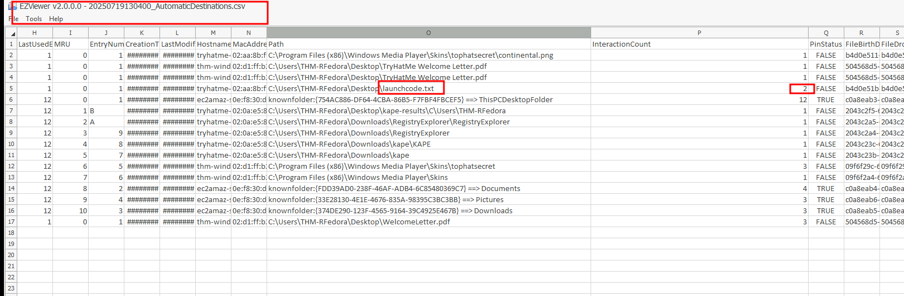
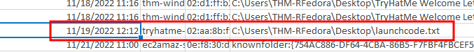
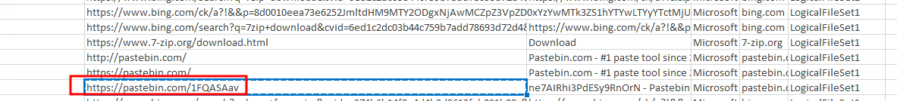
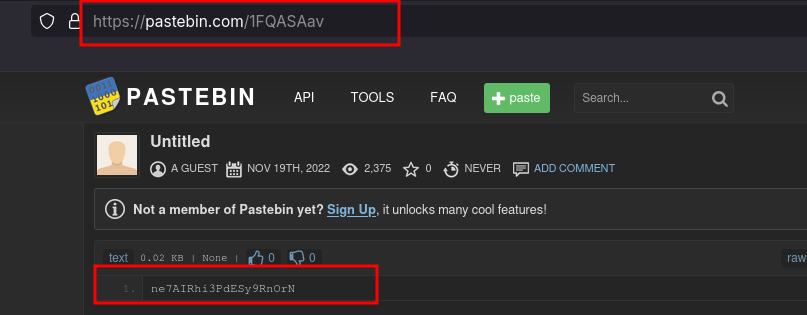

# Unattended 
- [here](https://tryhackme.com/room/unattended)

## Scenario
A newly hired employee at a client company noticed a suspicious janitor exiting their office during lunch on November 19, 2022, between 12:05 PM and 12:45 PM. Initial investigations confirm unauthorized user activity on the employee’s computer during this timeframe. The intruder appeared to know what to search for, accessed specific files, downloaded a tool, and exfiltrated data externally. Using **Autopsy** and **Eric Zimmerman’s tools** (e.g., Registry Explorer, JLECmd), analyze the disk image and registry hives to identify the file types searched, files accessed, downloaded tools, and data exfiltration details.

## Challenge Questions and Findings

#### 1. File Type Searched in Windows Explorer
**Question**: What file type was searched for using the search bar in Windows Explorer?

**Answer**: `.pdf`

#### 2. Top-Secret Keyword Searched
**Question**: What top-secret keyword was searched for using the search bar in Windows Explorer?

**Answer**: `continental`

#### 3. Name of Downloaded File
**Question**: What is the name of the downloaded file to the Downloads folder?

**Answer**: `7z2201-x64.exe`

#### 4. Download Time of the File
**Question**: When was the file from the previous question downloaded? (YYYY-MM-DD HH:MM:SS UTC)

**Answer**: `2022-11-19 12:09:19`

#### 5. PNG File Open Time
**Question**: A PNG file was opened thanks to the previously downloaded file. When was this file opened? (YYYY-MM-DD HH:MM:SS)

**Answer**: `2022-11-19 12:10:00`

#### 6. Number of Times Text File Was Opened
**Question**: A text file was created in the Desktop folder. How many times was this file opened?

**Answer**: `2`

#### 7. Last Modified Time of Text File
**Question**: When was the text file from the previous question last modified? (MM/DD/YYYY HH:MM)

**Answer**: `11/19/2022 12:12`

#### 8. Pastebin URL of Exfiltrated Data
**Question**: The contents of the file were exfiltrated to pastebin.com. What is the generated URL of the exfiltrated data?

**Answer**: `https://pastebin.com/1FQASAav`

#### 9. String Copied to Pastebin
**Question**: What is the string that was copied to the pastebin URL?

**Answer**: `ne7AIRhi3PdESy9RnOrN`

