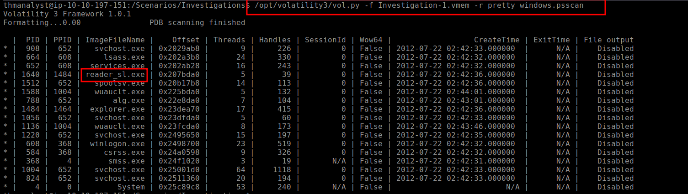

# Volatility Forensics Challenge: Investigating Banking Trojan and Ransomware

## Scenario
Two cases require memory forensics using **Volatility 3** to analyze memory dumps from compromised systems.

## Challenge Questions and Findings

### Case 001: Banking Trojan
#### 1. Build Version of the Host Machine
**Question**: What is the build version of the host machine in Case 001?

**Answer**: `2600.xpsp.080413-2111`

#### 2. Memory File Acquisition Time
**Question**: At what time was the memory file acquired in Case 001?

**Answer**: `2012-07-22 02:45:08`

#### 3. Suspicious Process
**Question**: What process can be considered suspicious in Case 001?

**Answer**: `reader_sl.exe`

#### 4. Parent Process of Suspicious Process
**Question**: What is the parent process of the suspicious process in Case 001?

**Answer**: `explorer.exe`

#### 5. PID of Suspicious Process
**Question**: What is the PID of the suspicious process in Case 001?

**Answer**: `1640`

#### 6. Parent Process PID
**Question**: What is the parent process PID in Case 001?

**Answer**: `1484`

#### 7. User-Agent Employed by Adversary
**Question**: What user-agent was employed by the adversary in Case 001?

**Answer**: `Mozilla/5.0 (Windows; U; MSIE 7.0; Windows NT 6.0; en-US)`

#### 8. Chase Bank as Suspicious Domain
**Question**: Was Chase Bank one of the suspicious bank domains found in Case 001? (Y/N)

**Answer**: `Y`

### Case 002: Ransomware
#### 9. Suspicious Process at PID 740
**Question**: What suspicious process is running at PID 740 in Case 002?

**Answer**: `@WanaDecryptor@`

#### 10. Full Path of Suspicious Binary
**Question**: What is the full path of the suspicious binary in PID 740 in Case 002?

**Answer**: `C:\Intel\ivecuqmanpnirkt615\@WanaDecryptor@.exe`

#### 11. Parent Process of PID 740
**Question**: What is the parent process of PID 740 in Case 002?

**Answer**: `tasksche.exe`

#### 12. Suspicious Parent Process PID
**Question**: What is the suspicious parent process PID connected to the decryptor in Case 002?

**Answer**: `1940`

#### 13. Malware Present
**Question**: From our current information, what malware is present on the system in Case 002?

**Answer**: `WannaCry`

#### 14. DLL for Socket Creation
**Question**: What DLL is loaded by the decryptor used for socket creation in Case 002?

**Answer**: `Ws2_32.dll`

#### 15. Mutex Indicator of Malware
**Question**: What mutex can be found that is a known indicator of the malware in question in Case 002?

**Answer**: `MsWinZonesCacheCounterMutexA`

#### 16. Plugin for File Identification
**Question**: What plugin could be used to identify all files loaded from the malware working directory in Case 002?

**Answer**: `windows.filescan`

