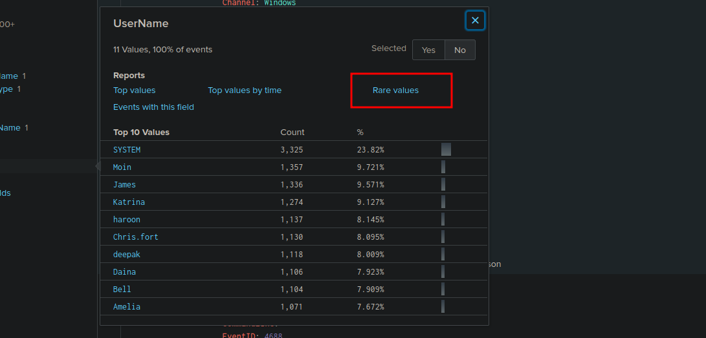

# Investigating Suspicious Activity with Splunk: Benign

SOC Analyst Johny observed suspicious scheduled tasks on Windows machines, indicating potential malicious activity. Process execution logs (Event ID: 4688) were ingested into Splunk’s `win_eventlogs` index for March 2022 to investigate. The network is divided into three departments—IT (James, Moin, Katrina), HR (Haroon, Chris, Diana), and Marketing (Bell, Amelia, Deepak).

## Scenario

Suspicious scheduled tasks and process executions suggest an adversary has compromised hosts, potentially downloading malicious payloads. The task is to analyze logs in the `win_eventlogs` index to uncover details about the imposter account, user activities in the HR department, the use of living-off-the-land binaries (LOLBINs), and interactions with a C2 server.

## Investigation Questions and Findings

### 1. Number of Logs Ingested for March 2022
**Question**: How many logs are ingested from the month of March, 2022?

**Search**: Queried `index=win_eventlogs` with the time range set to March 1, 2022, to March 31, 2022, in Splunk’s Search & Reporting App.

**Finding**: 13,959 logs were ingested.

**Answer**: 13,959 logs

### 2. Imposter Account Name
**Question**: There seems to be an imposter account observed in the logs, what is the name of that user?

**Search**: Queried `index=win_eventlogs EventCode=4688` for user accounts, identifying `Amel1a` as suspicious due to its similarity to the legitimate user `Amelia`.

**Finding**: The imposter account is `Amel1a`, likely created to mimic `Amelia`.

**Answer**: `Amel1a`

### 3. HR Department User Running Scheduled Tasks
**Question**: Which user from the HR department was observed to be running scheduled tasks?

**Search**: Queried `index=win_eventlogs EventCode=4688 schtasks` for users in the HR department (Haroon, Chris, Diana), identifying `Chris.fort` executing `schtasks`.

**Finding**: The HR user is `Chris.fort`.

**Answer**: `Chris.fort`

### 4. HR Department User Executing LOLBIN for Payload Download
**Question**: Which user from the HR department executed a system process (LOLBIN) to download a payload from a file-sharing host?

**Search**: Queried `index=win_eventlogs EventCode=4688` for HTTP/HTTPS activity by HR users, filtering for system processes. Found `Haroon` using a LOLBIN to access an HTTPS URL.

**Finding**: The HR user is `Haroon`.

**Answer**: `Haroon`

### 5. LOLBIN Used for Payload Download
**Question**: To bypass the security controls, which system process (LOLBIN) was used to download a payload from the internet?

**Finding**: The LOLBIN is `certutil.exe`.

**Answer**: `certutil.exe`

### 6. Date of Binary Execution
**Question**: What was the date that this binary was executed by the infected host? (Format: YYYY-MM-DD)

**Finding**: The binary was executed on `2022-03-04`.

**Answer**: `2022-03-04`

### 7. Third-Party Site for Payload Download
**Question**: Which third-party site was accessed to download the malicious payload?

**Finding**: The site is `controlc.com`.

**Answer**: `controlc.com`

### 8. Name of the File Saved from C2 Server
**Question**: What is the name of the file that was saved on the host machine from the C2 server during the post-exploitation phase?

**Finding**: The file is `benign.exe`.

**Answer**: `benign.exe`

### 9. Malicious Content Pattern in the File
**Question**: The suspicious file downloaded from the C2 server contained malicious content with the pattern THM{..........}; what is that pattern?

**Search**: Queried `index=win_eventlogs EventCode=4688 benign.exe` and inspected related logs, confirming the file content via the C2 URL.

**Finding**: The pattern is `THM{KJ&*H^B0}`.

**Answer**: `THM{KJ&*H^B0}`

### 10. URL Connected by the Infected Host
**Question**: What is the URL that the infected host connected to?

**Search**: Queried `index=win_eventlogs EventCode=4688 benign.exe` to identify network activity, confirming the URL from HTTPS logs.

**Finding**: The URL is `https://controlc.com/e4d11035`.

**Answer**: `https://controlc.com/e4d11035`

