# Malware Analysis Report:

## Scenario
You are a Malware Reverse Engineer supporting the SOC team in analyzing unknown binaries flagged for unusual behavior. Your task is to examine the binaries and provide details to aid in threat remediation. 

## Analysis Questions and Answers

1. **Based on the ARCHITECTURE of the binary, is malbuster_1 a 32-bit or a 64-bit application?**  
   **Answer**: 32-bit  
   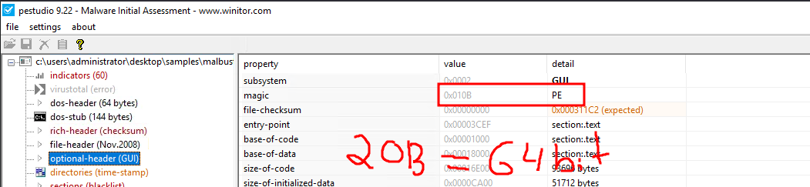

2. **What is the MD5 hash of malbuster_1?**  
   **Answer**: 4348DA65E4AEAE6472C7F97D6DD8AD8F  
   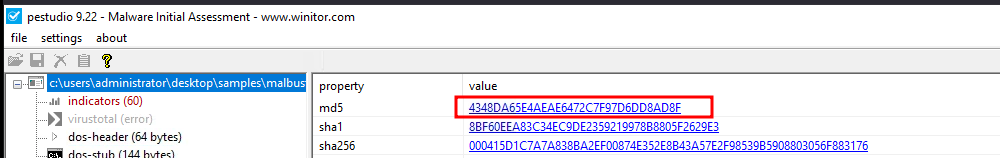

3. **Using the hash, what is the popular threat label of malbuster_1 according to VirusTotal?**  
   **Answer**: trojan.zbot/razy  
   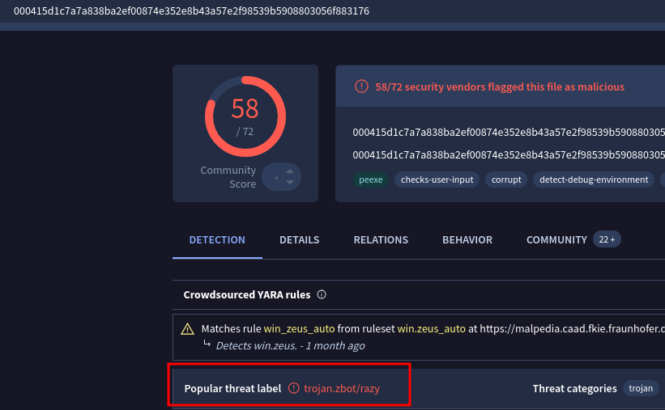

4. **Based on VirusTotal detection, what is the malware signature of malbuster_2 according to Avira?**  
   **Answer**: HEUR/AGEN.1306860  
   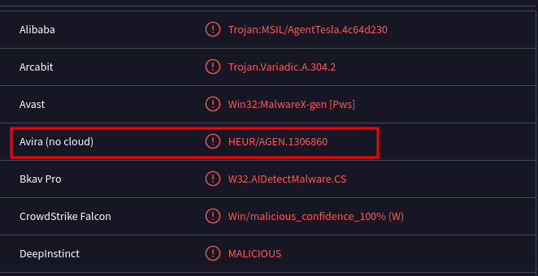

5. **malbuster_2 imports the function _CorExeMain. From which DLL file does it import this function?**  
   **Answer**: mscoree.dll  
   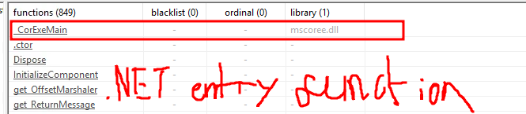

6. **Based on the VS_VERSION_INFO header, what is the original name of malbuster_2?**  
   **Answer**: 7JYpE.exe  
   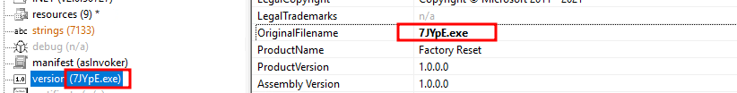

7. **Using the hash of malbuster_3, what is its malware signature based on abuse.ch?**  
   **Answer**: TrickBot  
   

8. **Using the hash of malbuster_4, what is its malware signature based on abuse.ch?**  
   **Answer**: ZLoader  
   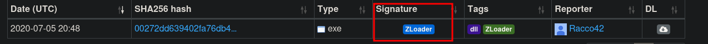

9. **What is the message found in the DOS_STUB of malbuster_4?**  
   **Answer**: !This Salfram cannot be run in DOS mode  
   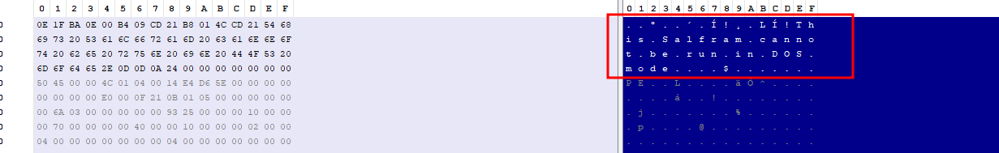

10. **malbuster_4 imports the function ShellExecuteA. From which DLL file does it import this function?**  
    **Answer**: shell32.dll  
    

11. **Using capa, how many anti-VM instructions were identified in malbuster_1?**  
    **Answer**: 3  
    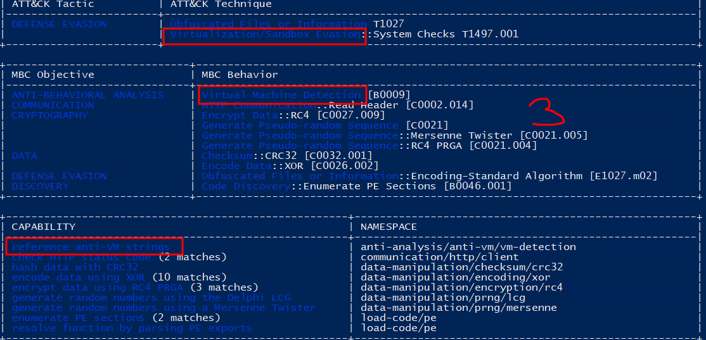

12. **Using capa, which binary can log keystrokes?**  
    **Answer**: malbuster_3  
    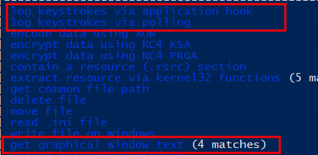

13. **Using capa, what is the MITRE ID of the DISCOVERY technique used by malbuster_4?**  
    **Answer**: T1083  
    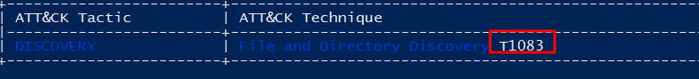

14. **Which binary contains the string GodMode?**  
    **Answer**: malbuster_2  
    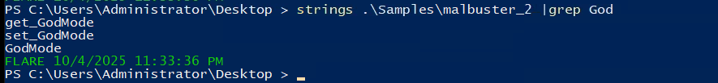

15. **Which binary contains the string Mozilla/4.0 (compatible; MSIE 6.0; Windows NT 5.1; SV1)?**  
    **Answer**: malbuster_1  
    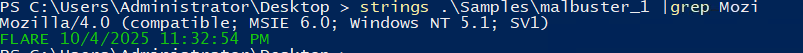
