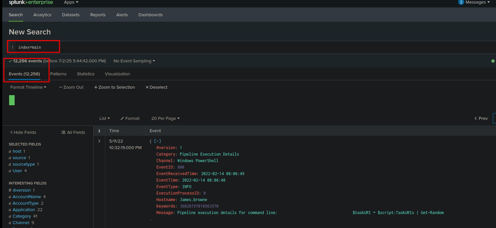
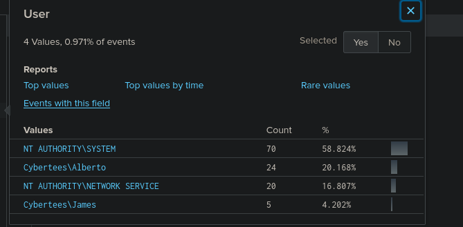
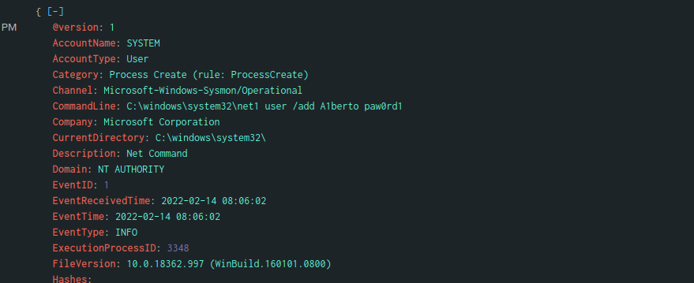
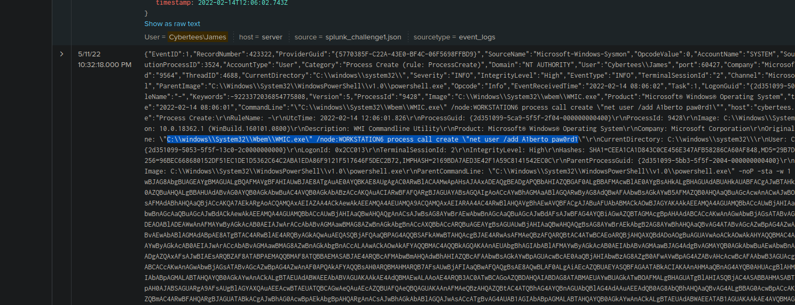
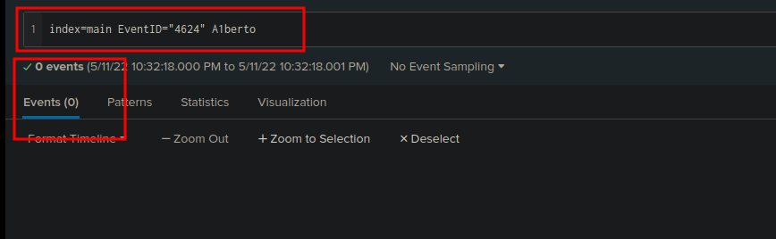
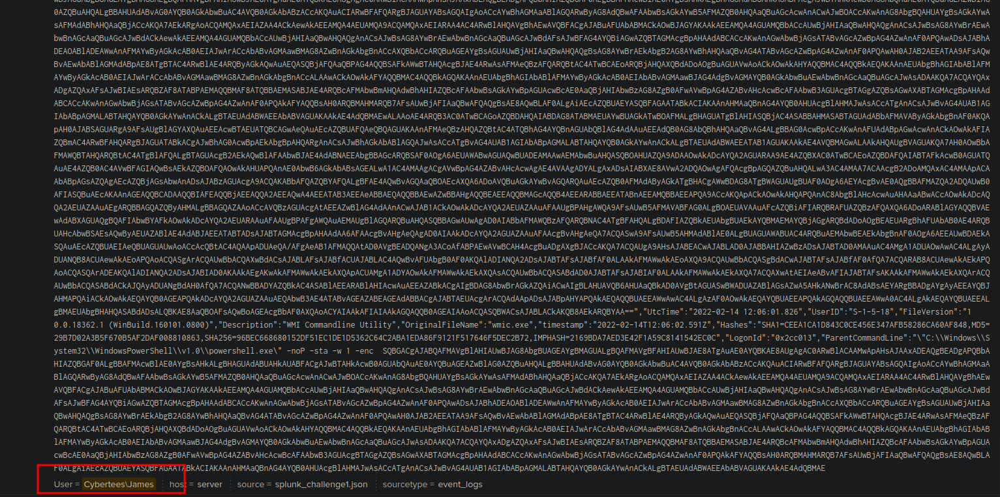
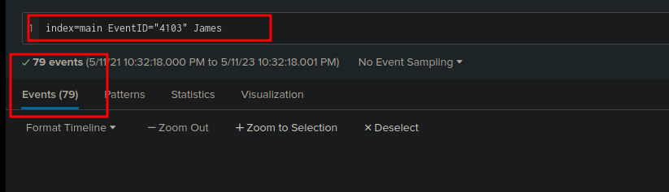
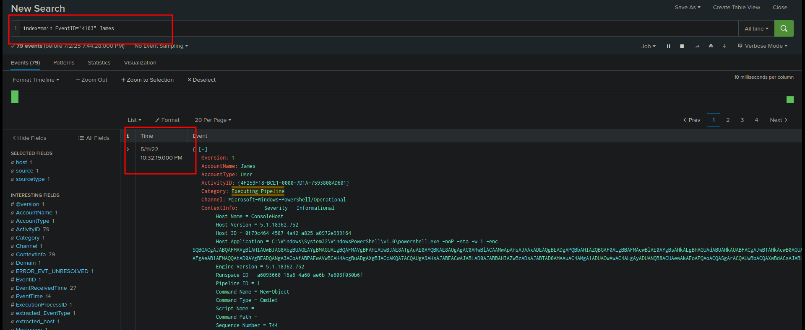
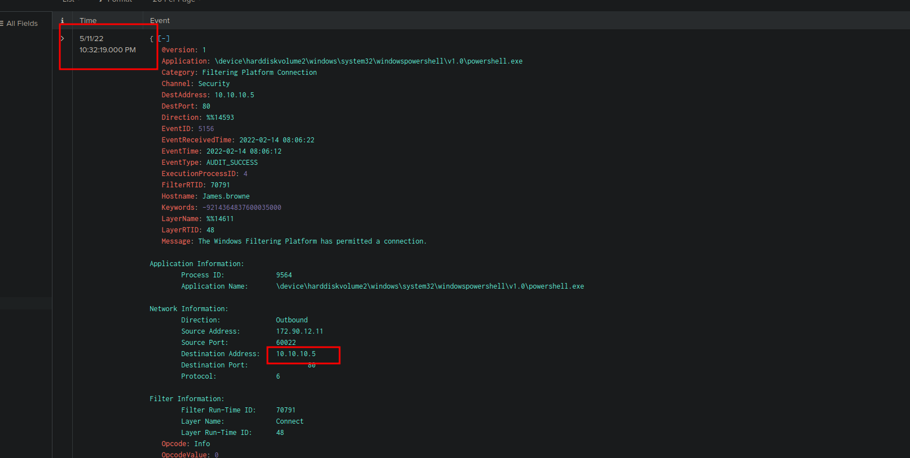
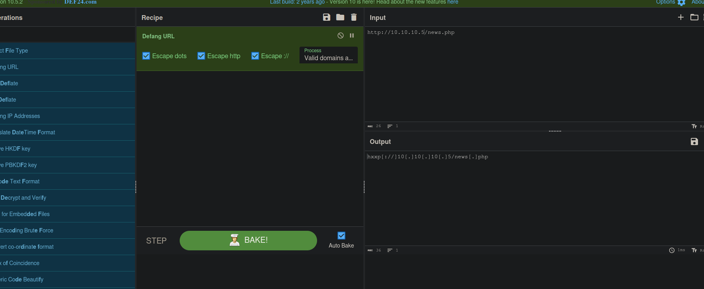

# Investigating with Splunk: Windows Machine Backdoor Incident

SOC Analyst Johny observed anomalous behaviors in logs from several Windows machines at Wayne Enterprises, indicating that an adversary gained access and created backdoors. The logs from suspected hosts were ingested into Splunk’s `main` index for investigation. This README details the analysis of these logs using Splunk Search Processing Language (SPL) to identify anomalies, focusing on a backdoor user, registry changes, impersonation attempts, and malicious PowerShell activity. Findings are supported by screenshots in `./screenshots/*.png`, adhering to the provided input without additional assumptions.

## Scenario

An adversary has compromised Windows machines, creating a backdoor user and executing suspicious PowerShell commands. The task is to analyze logs in the `main` index to answer specific questions about the incident, including event counts, backdoor user details, registry changes, impersonation, commands used, login attempts, affected hosts, and malicious web requests.

## Investigation Questions and Findings

### 1. Number of Events in the Main Index
**Question**: How many events were collected and ingested in the index `main`?

**Search**: Queried `index=main` without filters to count all events in the Splunk Search & Reporting App.

**Finding**: 12,256 events were ingested.

**Answer**: 12,256 events.

### 2. Backdoor Username
**Question**: On one of the infected hosts, the adversary was successful in creating a backdoor user. What is the new username?

**Search**: Queried `index=main` for user creation events, identifying four users. Two were common (`NT AUTHORITY\SYSTEM`, `Administrator`), while `james` and `a1berto` were less frequent. Analyzed `james` (least activity) and found it added `a1berto`, indicating `a1berto` as the backdoor user.

**Finding**: The backdoor username is `a1berto`.

**Answer**: `a1berto`

### 3. Registry Key Path for Backdoor User
**Question**: On the same host, a registry key was also updated regarding the new backdoor user. What is the full path of that registry key?

**Search**: Queried `index=main sourcetype=winRegistry user=a1berto` to find registry changes related to the backdoor user.

**Finding**: The registry key path is `HKLM\SAM\SAM\Domains\Account\Users\Names\A1berto`.

**Answer**: `HKLM\SAM\SAM\Domains\Account\Users\Names\A1berto`

### 4. User Impersonated by the Adversary
**Question**: Examine the logs and identify the user that the adversary was trying to impersonate.

**Search**: Analyzed `index=main user=a1berto` logs, noting similarities between `a1berto` and `Alberto`, suggesting the adversary created `a1berto` to mimic `Alberto`.

**Finding**: The adversary attempted to impersonate `Alberto`.

**Answer**: `Alberto`

### 5. Command to Add Backdoor User
**Question**: What is the command used to add a backdoor user from a remote computer?

**Search**: Queried `index=main sourcetype=wineventlog a1berto` for process creation events, identifying a WMIC command executed remotely.

**Finding**: The command is `"C:\windows\System32\Wbem\WMIC.exe" /node:WORKSTATION6 process call create "net user /add A1berto paw0rd1"`.

**Answer**: `"C:\windows\System32\Wbem\WMIC.exe" /node:WORKSTATION6 process call create "net user /add A1berto paw0rd1"`

### 6. Login Attempts by Backdoor User
**Question**: How many times was the login attempt from the backdoor user observed during the investigation?

**Search**: Queried `index=main sourcetype=wineventlog user=a1berto EventCode=4624` for successful login events by `a1berto`.

**Finding**: Zero login attempts were observed.

**Answer**: 0 times

### 7. Name of the Infected Host
**Question**: What is the name of the infected host on which suspicious PowerShell commands were executed?

**Search**: Queried `index=main sourcetype=powershell A1berto` to identify hosts running suspicious PowerShell commands, finding `James.browne`.

**Finding**: The infected host is `James.browne`.

**Answer**: `James.browne`

### 8. Number of Malicious PowerShell Events
**Question**: PowerShell logging is enabled on this device. How many events were logged for the malicious PowerShell execution?

**Search**: Queried `index=main sourcetype=powershell host=James.browne` to count malicious PowerShell events.

**Finding**: 79 events were logged.

**Answer**: 79 events

### 9. Full URL of the Web Request
**Question**: An encoded PowerShell script from the infected host initiated a web request. What is the full URL?

**Search**: Queried `index=main sourcetype=powershell host=James.browne` and identified a Base64-encoded script containing `http://10.1/new.php`. Filtered by similar timestamps and `src_ip=10.10.10.5` in `index=main sourcetype=stream:http`, confirming the full URL as `http://10.10.10.5/news.php`.

**Finding**: The full URL is `http://10.10.10.5/news.php`.

**Answer**: `http://10.10.10.5/news.php`

## Splunk Configuration
- **Index**: `main` contains logs from Windows Event Logs (`wineventlog`), Sysmon (`XmlWinEventLog`), PowerShell (`powershell`), and HTTP traffic (`stream:http`).
- **Search**: Used SPL queries in the Search & Reporting App, filtering by `sourcetype`, `user`, `host`, `src_ip`, and `EventCode`.
- **Data Ingestion**: Logs from suspected hosts were ingested via Splunk Forwarders, processed by Indexers, and searched via the Search Head.

## Recommendations
- **Remove Backdoor User**: Delete the `a1berto` account from `James.browne` and other hosts.
- **Reset Credentials**: Reset passwords for `Alberto` and other legitimate users to prevent impersonation.
- **Block Malicious IP**: Add `10.10.10.5` to firewall blocklists to prevent C2 communication.
- **Audit Registry**: Remove or monitor changes to `HKLM\SAM\SAM\Domains\Account\Users\Names\A1berto`.
- **Investigate WMIC**: Review remote WMIC usage (`WMIC.exe`) and restrict to authorized systems.
- **Enhance PowerShell Logging**: Ensure PowerShell Script Block Logging captures all commands for future analysis.
- **Alerting**: Create Splunk alerts for:
  - New user creation: `index=main sourcetype=wineventlog EventCode=4720`.
  - Suspicious PowerShell: `index=main sourcetype=powershell A1berto`.

## Documentation
- Splunk Documentation: [docs.splunk.com](https://docs.splunk.com)
- SPL Reference: [docs.splunk.com/Documentation/Splunk/9.0.0/SearchReference](https://docs.splunk.com/Documentation/Splunk/9.0.0/SearchReference)