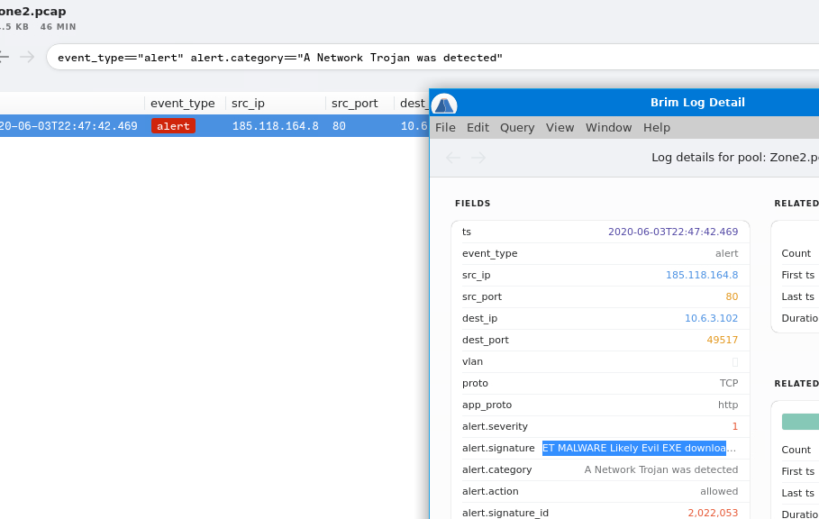

# Warzone 2: Investigating Network Trojan and Potential Corporate Privacy Violation

[here](https://tryhackme.com/room/warzonetwo)

## Investigation Process

### Step 1: Alert Signature for A Network Trojan Was Detected

In **Brim**, load `Zone2.pcap` and filter for:

```bash
event_type=="alert" alert.category=="A Network Trojan was detected"
```

**Output**: The alert signature is `ET MALWARE Likely Evil EXE download from MSXMLHTTP non-exe extension M2`.

**Answer**:
- **What was the alert signature for A Network Trojan was Detected?** `ET MALWARE Likely Evil EXE download from MSXMLHTTP non-exe extension M2`

**Screenshot**:


### Step 2: Alert Signature for Potential Corporate Privacy Violation

Filter in **Brim**:

```bash
event_type=="alert" alert.category=="Potential Corporate Privacy Violation" | cut alert.signature
```

**Output**: The alert signature is `ET POLICY PE EXE or DLL Windows file download HTTP`.

**Answer**:
- **What was the alert signature for Potential Corporate Privacy Violation?** `ET POLICY PE EXE or DLL Windows file download HTTP`

**Screenshot**:


### Step 3: IP Triggering Either Alert

Filter in **Brim**:

```bash
event_type=="alert" alert.category=="Potential Corporate Privacy Violation" | cut src_ip, dest_ip
```

**Output**: Source IP is `185.118.164.8`. Defang using **CyberChef**’s **Defang IP Addresses** recipe.

**Answer**:
- **What was the IP to trigger either alert?** `185[.]118[.]164[.]8`

**Screenshots**:


### Step 4: Full URI for Malicious Downloaded File

Filter in **Brim**:

```bash
_path == 'http' id.resp_h==185.118.164.8
```

**Output**: The URI is `http://awh93dhkylps5ulnq-be.com/czwih/fxla.php?l=gap1.cab`. Defang using **CyberChef**’s **Defang URL** recipe.

**Answer**:
- **Provide the full URI for the malicious downloaded file?** `awh93dhkylps5ulnq-be[.]com/czwih/fxla[.]php?l=gap1[.]cab`

**Screenshots**:


### Step 5: Payload Name Within the CAB File

In **Wireshark**, open `Zone2.pcap`, filter for `ip.dst == 185.118.164.8 && http`, and export HTTP objects via **File > Export Objects > HTTP**. Select `gap1.cab` (packet 415). Calculate the SHA256 hash in the terminal:

```bash
sha256sum gap1.cab
```

**Output**: `3769a84dbe7ba74ad7b0b355a864483d3562888a67806082ff094a56ce73bf7e`

Search the hash in **VirusTotal**. The payload name is `draw.dll`.

**Answer**:
- **What is the name of the payload within the cab file?** `draw.dll`

**Screenshots**:


### Step 6: User-Agent Associated with Network Traffic

Using the same **Brim** filter:

```bash
_path == 'http' id.resp_h==185.118.164.8
```

Double-click the HTTP entry to view details. The `user_agent` is `Mozilla/4.0 (compatible; MSIE 7.0; Windows NT 10.0; WOW64; Trident/8.0; .NET4.0C; .NET4.0E)`.

**Answer**:
- **What is the user-agent associated with this network traffic?** `Mozilla/4.0 (compatible; MSIE 7.0; Windows NT 10.0; WOW64; Trident/8.0; .NET4.0C; .NET4.0E)`

**Screenshot**:


### Step 7: Other Malicious Domains in Network Traffic

Filter in **Brim**:

```bash
_path=="http" id.resp_h==176.119.156.128 | cut id.orig_h, id.resp_h, id.resp_p, method, host, uri | uniq -c
```

**Output**: Hosts include `a-zcorner.com` and `knockoutlights.com`. Both are flagged as malicious in **VirusTotal**. Defang using **CyberChef**.

**Answer**:
- **What other domains are labelled as malicious by VirusTotal?** `a-zcorner[.]com,knockoutlights[.]com`

**Screenshots**:


### Step 8: IP Addresses Flagged as Not Suspicious Traffic

Filter in **Brim**:

```bash
event_type=="alert" alert.category=="Not Suspicious Traffic"
```

**Output**: IPs are `64.225.65.166` and `142.93.211.176`. Defang using **CyberChef**.

**Answer**:
- **What are the IP addresses flagged as Not Suspicious Traffic?** `64[.]225[.]65[.]166,142[.]93[.]211[.]176`

**Screenshots**:


### Step 9: Malicious Domains Associated with First Not Suspicious IP

Filter in **Brim**:

```bash
_path=="dns" | cut query | uniq | uniq -c
```

**Output**: For IP `64.225.65.166`, check **VirusTotal**’s **Relations > Passive DNS Replication**. Domains in traffic flagged as malicious are `safebanktest.top`, `tocsicambar.xyz`, and `ulcertification.xyz`. Defang using **CyberChef**.

**Answer**:
- **What were the domains associated with the first Not Suspicious IP?** `safebanktest[.]top,tocsicambar[.]xyz,ulcertification[.]xyz`

**Screenshots**:


### Step 10: Domain Associated with Second Not Suspicious IP

Filter in **Brim**:

```bash
_path == 'ssl' id.resp_h==142.93.211.176
```

**Output**: The domain is `2partscow.top`. Defang using **CyberChef**.

**Answer**:
- **What was the domain associated with the second Not Suspicious IP?** `2partscow[.]top`

**Screenshots**:


