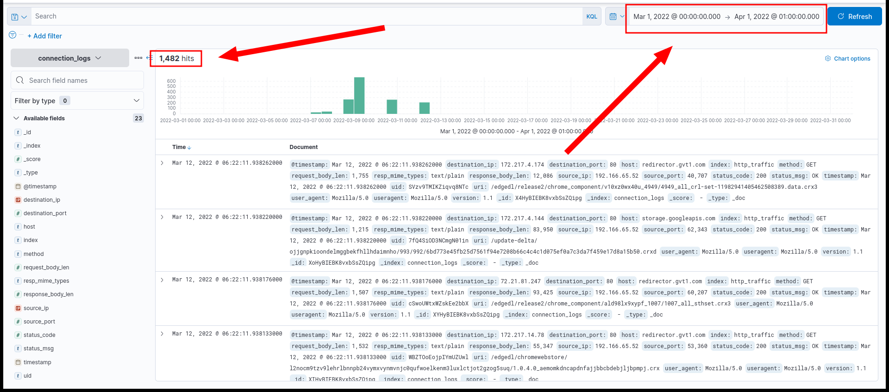
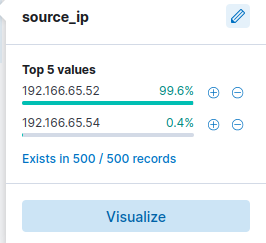
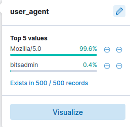
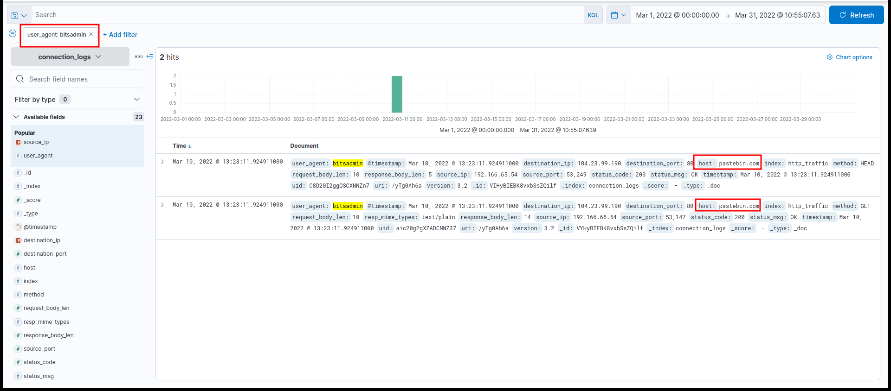

# ItsyBitsy CTF: Investigating C2 Communication with ELK [here](https://tryhackme.com/room/itsybitsy)

## Scenario

During SOC monitoring, Analyst John detected an IDS alert indicating potential Command and Control (C2) communication from HR department user Browne. A suspicious file containing a malicious pattern `THM:{ ________ }` was accessed. A week’s worth of HTTP connection logs for March 2022 have been ingested into the `connection_logs` index in Kibana for investigation. The task is to analyze these logs to identify the user’s activities, the malicious file, and the C2 infrastructure, answering specific questions to uncover details of the incident.

## Investigation Questions and Findings

### 1. Number of Events in March 2022
**Question**: How many events were returned for the month of March 2022?

**Search**: Used Kibana’s calendar filter in the Discover tab to set the time range for March 1, 2022, to March 31, 2022, on the `connection_logs` index.

**Finding**: The query returned 1482 events.

**Log**:
- Kibana screenshot showing 1482 hits for March 2022.

**Answer**: 1482 events were returned.

### 2. IP Associated with the Suspected User
**Question**: What is the IP associated with the suspected user in the logs?

**Search**: Filtered the `connection_logs` index by clicking the `source_ip` field in Kibana to view IP distribution. Observed two IPs: `192.166.65.52` (99.6%) and `192.166.65.54` (0.4%).

**Finding**: The IP `192.166.65.54` is suspicious due to its low frequency and association with malicious activity (see user agent analysis below). This is likely the IP of Browne’s infected machine.

**Log**:
- Kibana screenshot showing IP distribution.

**Answer**: The IP is `192.166.65.54`.

### 3. Legitimate Windows Binary Used
**Question**: The user’s machine used a legit Windows binary to download a file from the C2 server. What is the name of the binary?

**Search**: Analyzed the `user_agent` field in Kibana, noting `Mozilla` (99.6%) and `Microsoft BITS/7.8` (0.4%). Background Intelligent Transfer Service (BITS) uses `bitsadmin.exe` to download/upload files via HTTP or SMB, running under `svchost.exe`.

**Finding**: The low frequency of `Microsoft BITS/7.8` suggests it was used for malicious file downloads, making `bitsadmin.exe` the legitimate Windows binary exploited.

**Log**:
- Kibana screenshot showing user agent distribution.

**Answer**: The binary is `bitsadmin.exe`.

### 4. Famous Filesharing Site Used as C2 Server
**Question**: The infected machine connected with a famous filesharing site in this period, which also acts as a C2 server used by the malware authors to communicate. What is the name of the filesharing site?

**Search**: Filtered `connection_logs` by `user_agent:"Microsoft BITS/7.8"` to identify malicious traffic, revealing two hits. Analyzed the destination domain in these logs.

**Finding**: The logs show connections to `pastebin.com`, a well-known filesharing site often abused as a C2 server.

**Log**:
- Kibana screenshot showing `pastebin.com` in the destination field.

**Answer**: The filesharing site is `pastebin.com`.

### 5. Full URL of the C2 Server
**Question**: What is the full URL of the C2 to which the infected host is connected?

**Search**: From the filtered `user_agent:"Microsoft BITS/7.8"` results, examined the request URI field to identify the exact URL.

**Finding**: The full URL is `pastebin.com/yTg0Ah6a`.

**Log**:
- Kibana screenshot showing the URL in the logs.

**Answer**: The full URL is `pastebin.com/yTg0Ah6a`.

### 6/7. Name of the File Accessed
**Question**: A file was accessed on the filesharing site. What is the name of the file accessed?
**Question**: The file contains a secret code with the format `THM{_____}`. What is the secret code?

**Finding**: The file accessed on Pastebin is named `secret.txt`.
**Finding**: The file contains the code `THM{SECRET__CODE}`.

**Answer**: The file name is `secret.txt`, The secret code is `THM{SECRET__CODE}`

## Documentation
- Elastic Stack: [www.elastic.co/guide](https://www.elastic.co/guide)
- KQL Reference: [www.elastic.co/guide/en/kibana/7.17/kuery-query.html](https://www.elastic.co/guide/en/kibana/7.17/kuery-query.html)
