# Warzone 1: Investigating Potentially Bad Traffic and Malware Command and Control Activity

[here](https://tryhackme.com/room/warzoneone)
## Investigation Process

### Step 1: Identify the Alert Signature

Using **Brim**, load `Zone1.pcap` and filter for `event_type=="alert"`.

**Brim Output**: 
- Signature: `ET MALWARE MirrorBlast CnC Activity M3`

**Answer**: 
- **What was the alert signature for Malware Command and Control Activity Detected?** `ET MALWARE MirrorBlast CnC Activity M3`

**Screenshot**:
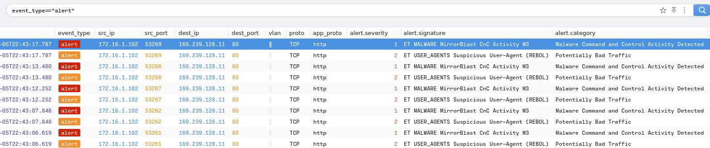

### Step 2: Extract Source and Destination IP Addresses

In **Brim**, inspect the alert details for source and destination IPs. Use **CyberChef** with the **Defang IP Addresses** recipe to defang the IPs.

**Brim Output**:
- Source IP: `172.16.1.102`
- Destination IP: `169.239.128.11`

**Defanged IPs**:
- Source: `172[.]16[.]1[.]102`
- Destination: `169[.]239[.]128[.]11`

**Answers**:
- **What is the source IP address?** `172[.]16[.]1[.]102`
- **What IP address was the destination IP in the alert?** `169[.]239[.]128[.]11`

**Screenshots**:
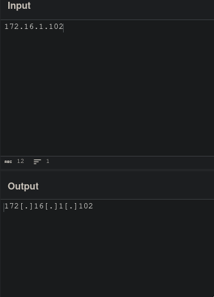
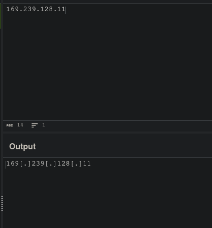

### Step 3: Analyze Destination IP in VirusTotal

Search the destination IP `169.239.128.11` in **VirusTotal** (using the **Search** option, not URL). Under the **Community** tab, the IP is attributed to the threat group **TA505** and associated with the **MirrorBlast** malware family.

**VirusTotal Findings**:
- Threat Group: `TA505`
- Malware Family: `MirrorBlast`

**Answers**:
- **What threat group is attributed to this IP address?** `TA505`
- **What is the malware family?** `MirrorBlast`

**Screenshot**:
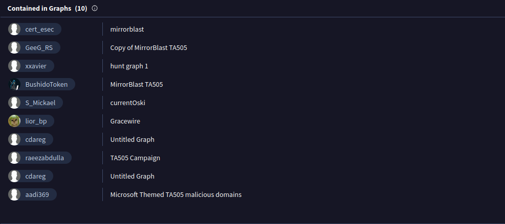

### Step 4: Analyze Associated Domain in VirusTotal

Under **VirusTotal**’s **Relations > Passive DNS Replication** for `169.239.128.11`, the domain `fidufagios.com` has the most detections (32/55 as of 2023-04-05). Search `fidufagios.com` in **VirusTotal**. The **Communicating Files** section lists **Windows Installer** as the majority file type.

**Answer**:
- **What was the majority file type listed under Communicating Files?** `Windows Installer`

**Screenshot**:
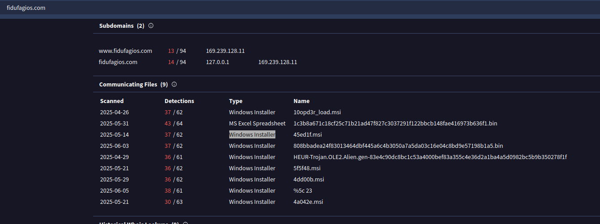

### Step 5: Inspect User-Agent in Web Traffic

In **Wireshark**, filter for `http` to inspect HTTP traffic.  The **User-Agent** is `REBOL View 2.7.8.3.1`.

**Answer**:
- **What is the user-agent in the traffic?** `REBOL View 2.7.8.3.1`

**Screenshot**:
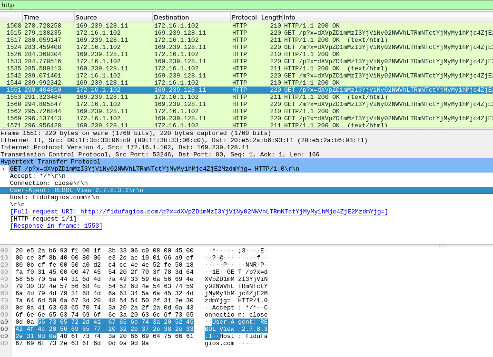

### Step 6: Identify Additional Malicious IP Addresses

In **Wireshark**, filter for HTTP traffic with `http.request` to identify other destination IPs. Search each IP in **VirusTotal** to confirm malicious activity. Two additional IPs are flagged as **MirrorBlast C2** servers:

- `185.10.68.235`
- `192.36.27.92`

**Defanged IPs**:
- `185[.]10[.]68[.]235`
- `192[.]36[.]27[.]92`

**Answer**:
- **What were two other IP addresses?** `185[.]10[.]68[.]235,192[.]36[.]27[.]92`

**Screenshots**:
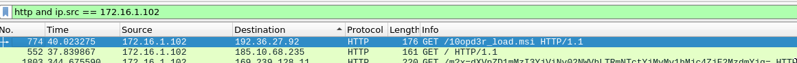
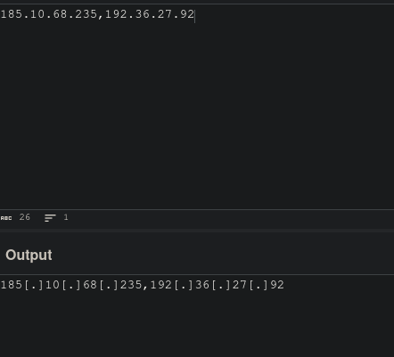
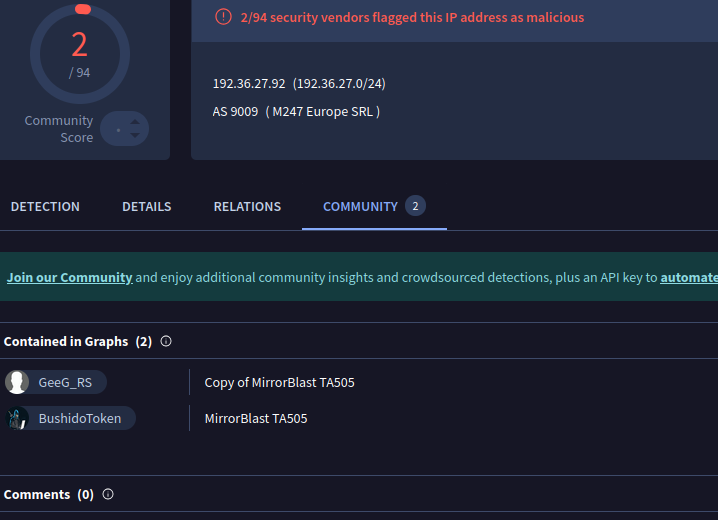
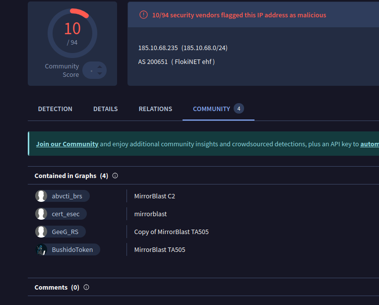

### Step 7: Identify Downloaded File Names

In **Brim**, filter for `185.10.68.235` and `192.36.27.92` under **File Activity** to find downloaded files. Alternatively, in **Wireshark**, filter for `ip.dst == 185.10.68.235` and `ip.dst == 192.36.27.92`, then check the **Info** field or follow TCP streams.

**Findings**:
- IP `185.10.68.235`: `filter.msi`
- IP `192.36.27.92`: `10opd3r_load.msi`

**Answer**:
- **What were the file names of the downloaded files?** `filter.msi,10opd3r_load.msi`

**Screenshots**:
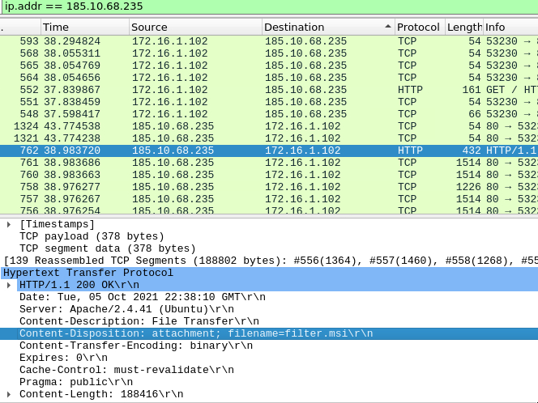
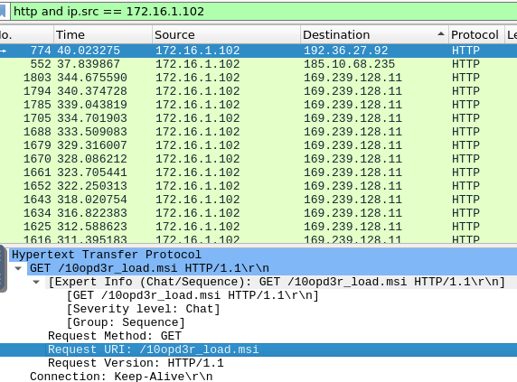

### Step 8: Inspect Traffic for First Downloaded File (filter.msi)

In **Wireshark**, filter for `ip.dst == 185.10.68.235 && http`. Right-click the first HTTP packet, select **Follow > HTTP Stream**, and search for `C:\`. The TCP stream reveals two files saved to the same directory:

- `C:\ProgramData\001\arab.bin`
- `C:\ProgramData\001\arab.exe`

**Answer**:
- **What is the full file path of the directory and the name of the two files?** `C:\ProgramData\001\arab.bin,C:\ProgramData\001\arab.exe`

**Screenshot**:
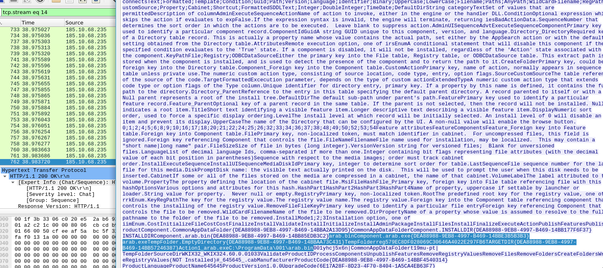

### Step 9: Inspect Traffic for Second Downloaded File (10opd3r_load.msi)

In **Wireshark**, filter for `ip.dst == 192.36.27.92 && http`. Follow the HTTP stream for the first HTTP packet. Scroll to the end of the stream to find two files saved to:

- `C:\ProgramData\Local\Google\rebol-view-278-3-1.exe`
- `C:\ProgramData\Local\Google\exemple.rb`

**Answer**:
- **What is the full file path of the directory and the name of the two files?** `C:\ProgramData\Local\Google\rebol-view-278-3-1.exe,C:\ProgramData\Local\Google\exemple.rb`

**Screenshot**:
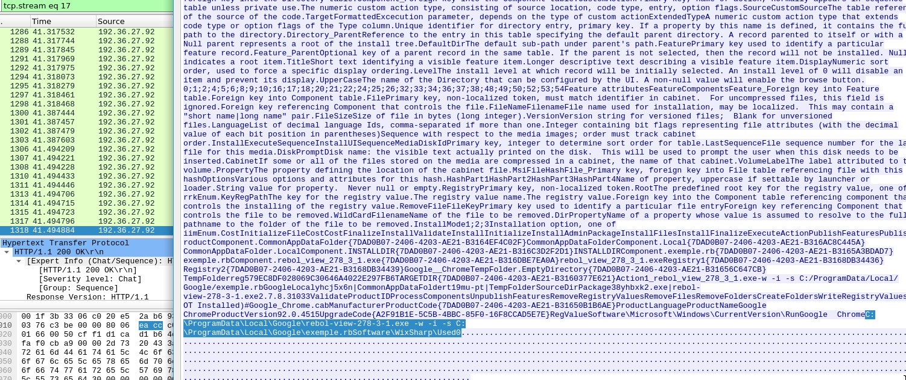

- **Screenshots**: Embedded using ``, assuming they’re in the repository’s `screenshots/` folder. Filenames reflect context (e.g., `brim_alert_signature.png`). Ensure screenshots are uploaded to GitHub.
- **Artifacts**: Includes `malicious_indicators.txt` and `mirrorblast_c2.suricata` with unique UUIDs.
- **Defanging**: IPs (`[.]`), domains (`[.]`), and URIs (`hxxp://`) are defanged per request.
- **Time**: Analysis as of June 08, 2025, 09:49 AM EEST.
- If specific screenshot filenames or additional details are needed, please clarify!
