# TShark Challenge II: Directory - Investigating Malicious Network Traffic

## Investigation Process

### Step 1: Investigate DNS Queries

To identify contacted domains, extract DNS queries using the following command:

```bash
tshark -r directory-curiosity.pcap -Y 'dns' -T fields -e dns.qry.name
```


**Analysis**: The output lists domains queried in the PCAP. `jx2-bavuong.com` stands out as suspicious due to its non-standard naming, unlike legitimate domains like `www.bing.com` or `ocsp.digicert.com`. Submitting `jx2-bavuong.com` to **VirusTotal** confirms it is flagged as **malicious/suspicious**.

**Answer**: 
- **What is the name of the malicious/suspicious domain?** `jx2-bavuong[.]com`

**Screenshots**:
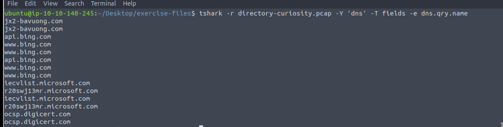
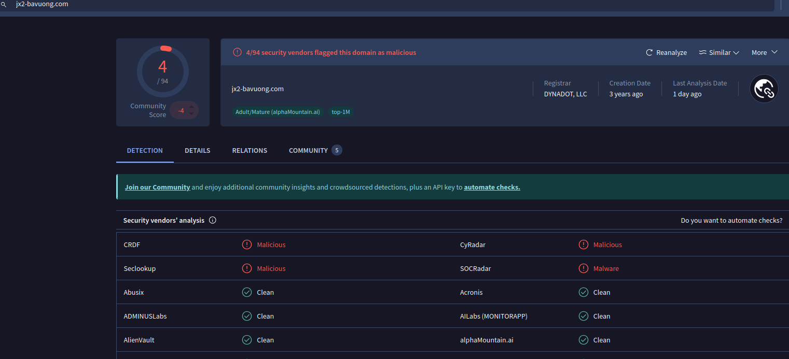
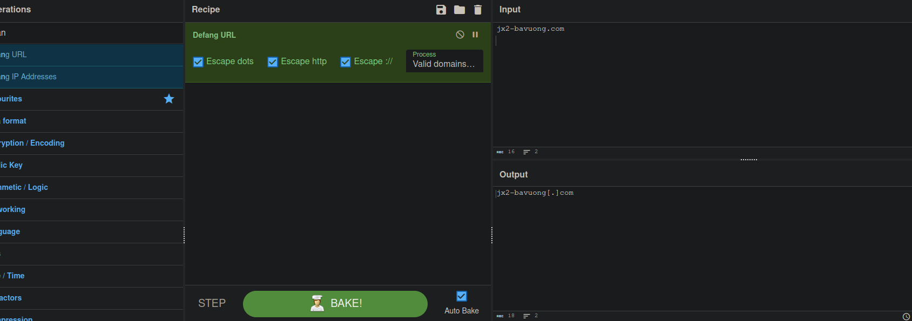

### Step 2: Count HTTP Requests to Malicious Domain

To determine the number of HTTP requests sent to `jx2-bavuong.com`, use:

```bash
tshark -r directory-curiosity.pcap -Y 'http and http.host == "jx2-bavuong.com"' | nl
```


**Analysis**: The command filters HTTP packets with `http.host == "jx2-bavuong.com"`, and `nl` numbers the lines. The output shows 14 HTTP GET requests to the malicious domain.

**Answer**: 
- **What is the total number of HTTP requests sent to the malicious domain?** 14

**Screenshot**:
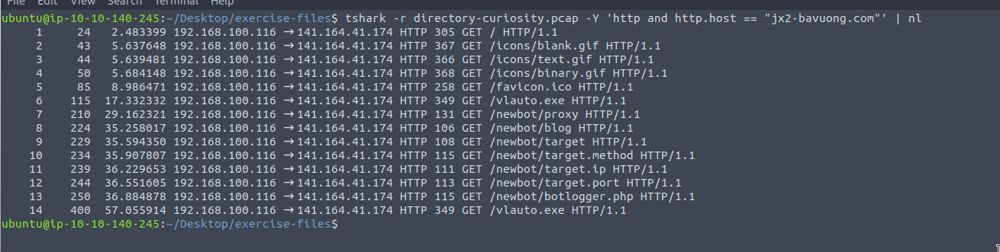

### Step 3: Identify IP Address of Malicious Domain

To find the IP address associated with `jx2-bavuong.com`, inspect DNS packets:

```bash
tshark -r directory-curiosity.pcap -Y 'dns'
```

**Analysis**: The DNS response for `jx2-bavuong.com` resolves to `141.164.41.174`. Defanging the IP using CyberChef yields `141[.]164[.]41[.]174`.

**Answer**: 
- **What is the IP address associated with the malicious domain?** `141[.]164[.]41[.]174`

**Screenshots**:
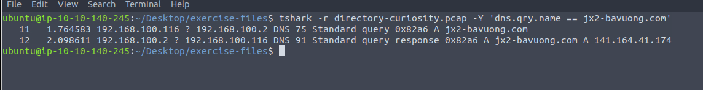
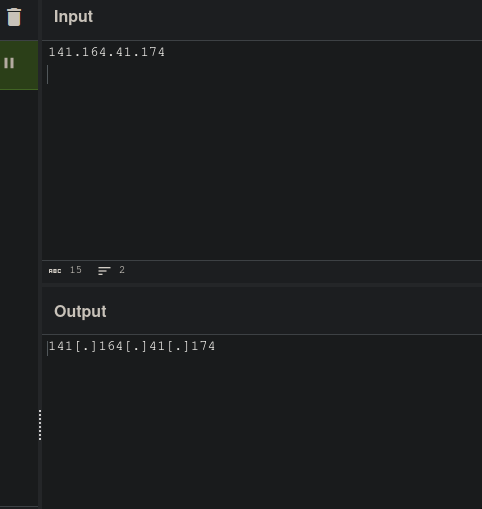

### Step 4: Determine Server Info of Suspicious Domain

To extract server information for `jx2-bavuong.com`, use:

```bash
tshark -r directory-curiosity.pcap -Y "http" -T fields -e http.server -e http.host | awk NF
```

**Analysis**: The `http.server` field for `jx2-bavuong.com` indicates the server is running `Apache/2.2.11 (Win32) DAV/2 mod_ssl/2.2.11 OpenSSL/0.9.8i PHP/5.2.9`.

**Answer**: 
- **What is the server info of the suspicious domain?** `Apache/2.2.11 (Win32) DAV/2 mod_ssl/2.2.11 OpenSSL/0.9.8i PHP/5.2.9`

**Screenshot**:
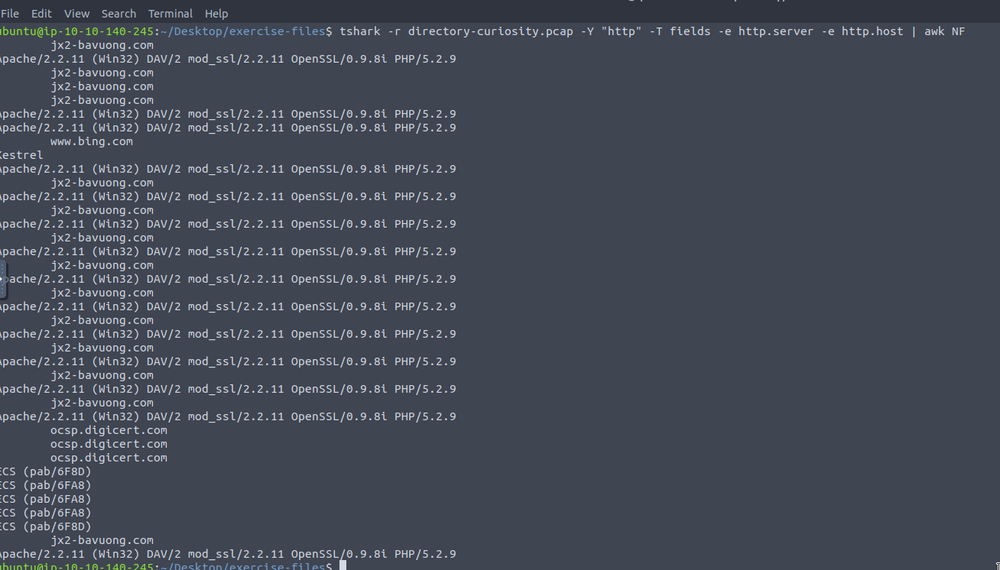

### Step 5: Follow First TCP Stream and Analyze Listed Files

To inspect the first TCP stream in ASCII, use:

```bash
tshark -r directory-curiosity.pcap -z follow,tcp,ascii,0 -q
```

**Analysis**: The TCP stream shows an HTTP response listing three files: `123.php`, `vlauto.exe`, and `vlauto.php`. The first file listed is `123.php`, defanged as `123[.]php`.

**Answers**:
- **What is the number of listed files?** 3
- **What is the filename of the first file?** `123[.]php`

**Screenshots**:
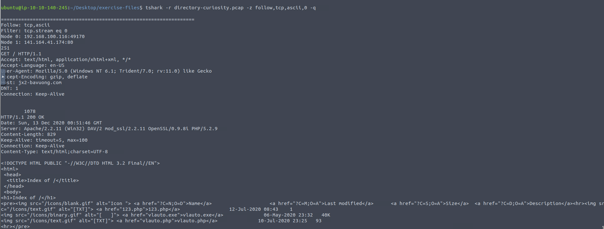
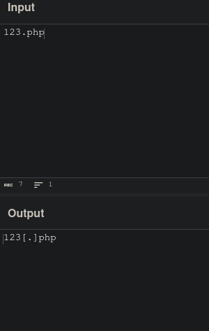

### Step 6: Export HTTP Traffic Objects and Identify Executable

To export HTTP objects, use:

```bash
tshark -r directory-curiosity.pcap --export-objects http,. -q
```


**Analysis**: The exported objects include `vlauto.exe`, identified as the downloaded executable. Defang as `vlauto[.]exe`.

**Answer**: 
- **What is the name of the downloaded executable file?** `vlauto[.]exe`

**Screenshots**:
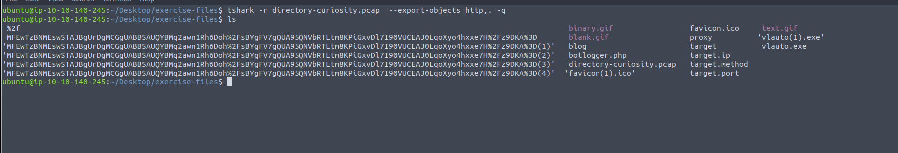
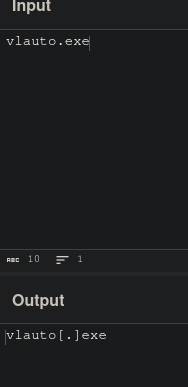

### Step 7: Compute SHA256 Hash of Malicious File

Calculate the SHA256 hash of `vlauto.exe`:

```bash
sha256sum vlauto.exe
```

**Answer**: 
- **What is the SHA256 value of the malicious file?** `b4851333efaf399889456f78eac0fd532e9d8791b23a86a19402c1164aed20de`

**Screenshot**:
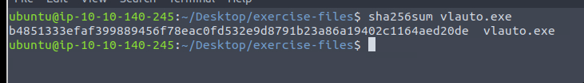

### Step 8: Analyze File on VirusTotal

Submit the SHA256 hash `b4851333efaf399889456f78eac0fd532e9d8791b23a86a19402c1164aed20de` to **VirusTotal**. The analysis provides:

- **PEiD Packer**: `.NET executable`
- **Lastline Sandbox Flag**: `MALWARE TROJAN`

**Answers**:
- **What is the "PEiD packer" value?** `.NET executable`
- **What does the "Lastline Sandbox" flag this as?** `MALWARE TROJAN`

**Screenshots**:
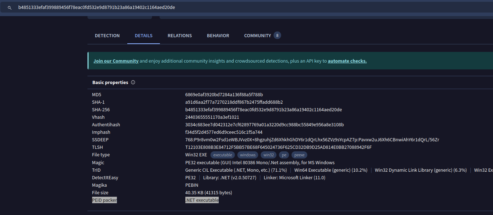
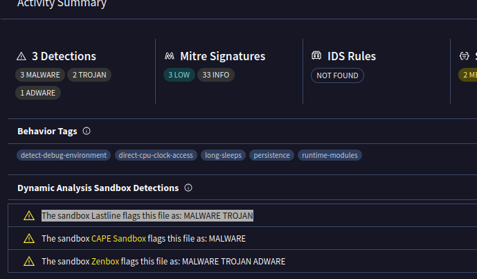


