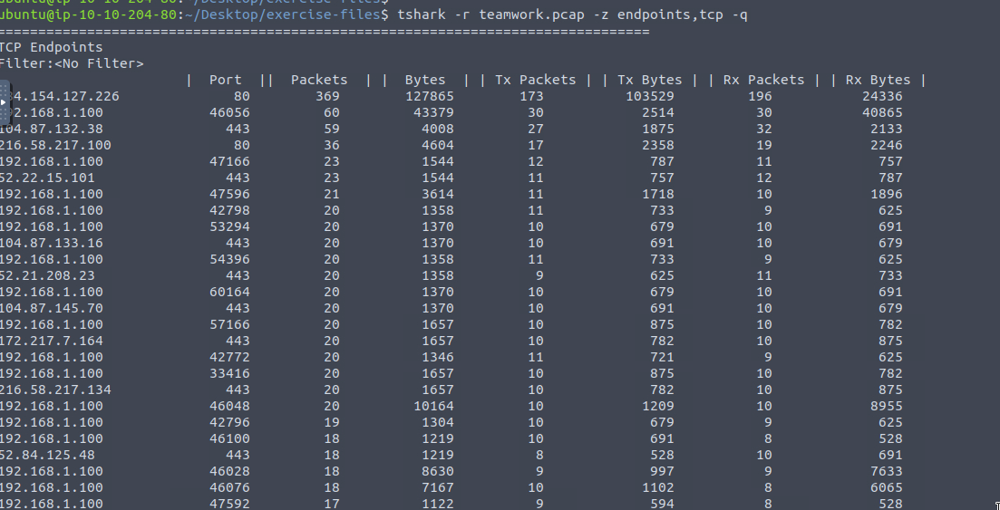
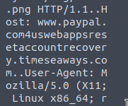
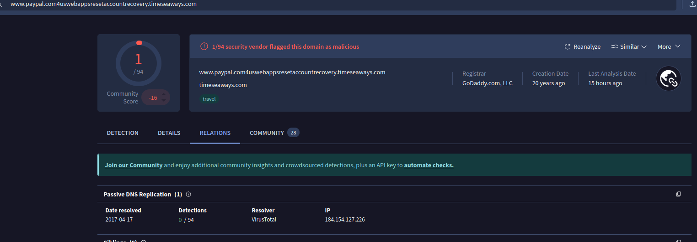
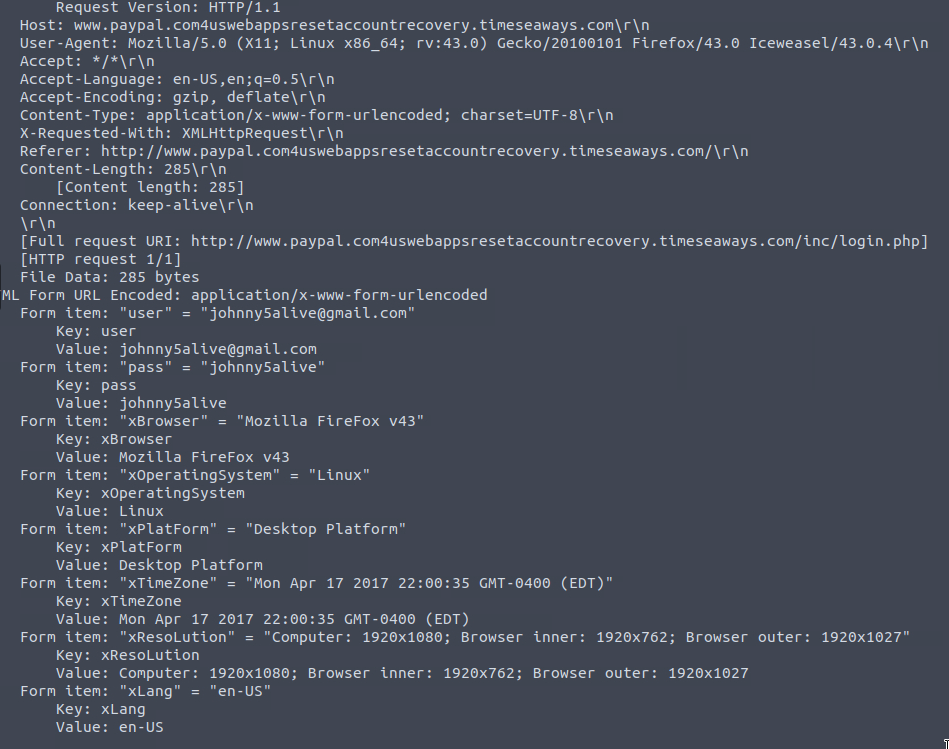

# Tshark Challenge I: Teamwork - Investigating a Suspicious Domain

## Investigation Process

### Step 1: Identify Contacted Domains

To investigate contacted domains, start by analyzing TCP endpoints to identify hosts communicating over HTTP (port 80) or HTTPS (port 443). Use the following TShark command:

```bash
tshark -r teamwork.pcap -z endpoints,tcp -q
```

**Explanation**: The `-z endpoints,tcp` option lists TCP endpoints, showing IPs, ports, packet counts, and byte volumes. The `-q` flag suppresses packet details, focusing on statistics. The output highlights `184[.]154[.]127[.]226` on port 80 with 103,529 Tx Bytes, indicating significant data transfer, which is suspicious for a potential malicious domain.

**Screenshot**:


To inspect HTTP traffic and extract domain details, examine packets with HTTP host headers:

```bash
tshark -r teamwork.pcap -Y "http.host" -x
```

**Explanation**: The `-Y "http.host"` filter selects packets with HTTP host headers, and `-x` displays packet contents in hex and ASCII. The output reveals an HTTP GET request containing the domain `www[.]paypal[.]com4uswebappsresetaccountrecovery[.]timeseaways[.]com`. Decoding the URL in CyberChef confirms: `hxxp[://]www[.]paypal[.]com4uswebappsresetaccountrecovery[.]timeseaways[.]com/`.

**Analysis**: The domain mimics PayPal’s legitimate URL (`www[.]paypal[.]com`) but includes a deceptive subdomain (`timeseaways[.]com`), suggesting a phishing attempt.

**Screenshot**:


### Step 2: Analyze Domains with VirusTotal

Submit the domain `www[.]paypal[.]com4uswebappsresetaccountrecovery[.]timeseaways[.]com` to **VirusTotal** for analysis. VirusTotal flags it as **malicious/suspicious**, confirming the threat.

**Findings from VirusTotal**:
- **Full URL**: `hxxp[://]www[.]paypal[.]com4uswebappsresetaccountrecovery[.]timeseaways[.]com/`
- **First Submission**: `2017-04-17 22:52:53 UTC`
- **Impersonated Service**: PayPal (evident from mimicking `www[.]paypal[.]com`)
- **IP Address**: `184[.]154[.]127[.]226`

**Explanation**: VirusTotal indicates the domain is designed to deceive users into believing it’s a PayPal account recovery page. The submission date shows when it was first reported, and the IP matches the high-traffic endpoint from the TCP endpoints output, confirming its role in the malicious activity.

**Screenshots**:



### Step 3: Extract Email Address

To find the email address used in the malicious activity, focus on HTTP POST requests, which often transmit form data like credentials. Use the following command:

```bash
tshark -r teamwork.pcap -Y "http.request.method matches POST" -V
```

**Explanation**: The `-Y "http.request.method matches POST"` filter selects POST requests, and `-V` provides verbose output, including form data. The output shows a POST to `/inc/login.php` on the malicious domain, with form fields:

```
Form item: "user" = "johnny5alive@gmail.com"
```

**Email Address**: `johnny5alive[at]gmail[.]com`

**Analysis**: The POST request submits an email and password, indicating a phishing attempt to capture credentials. Additional fields (e.g., browser type, OS) suggest device fingerprinting.

**Screenshot**:


